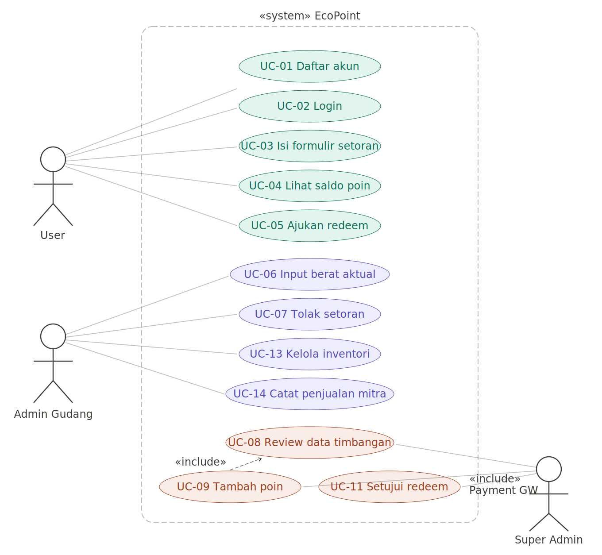
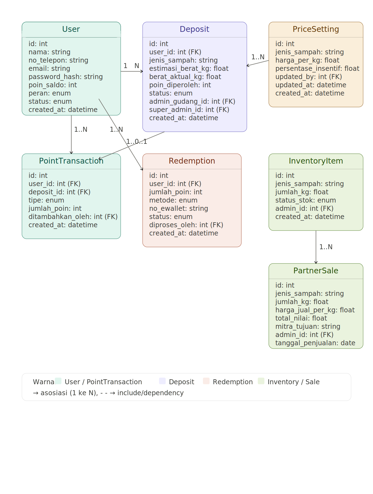
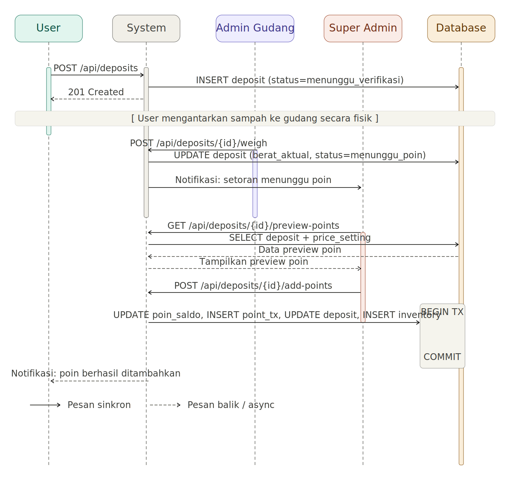
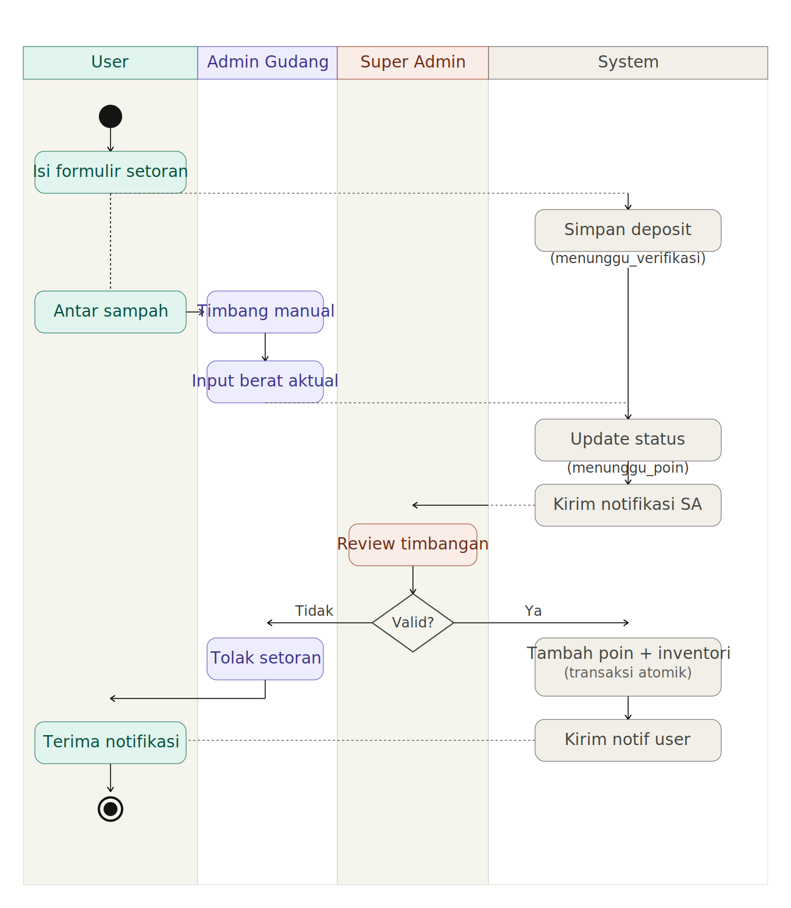
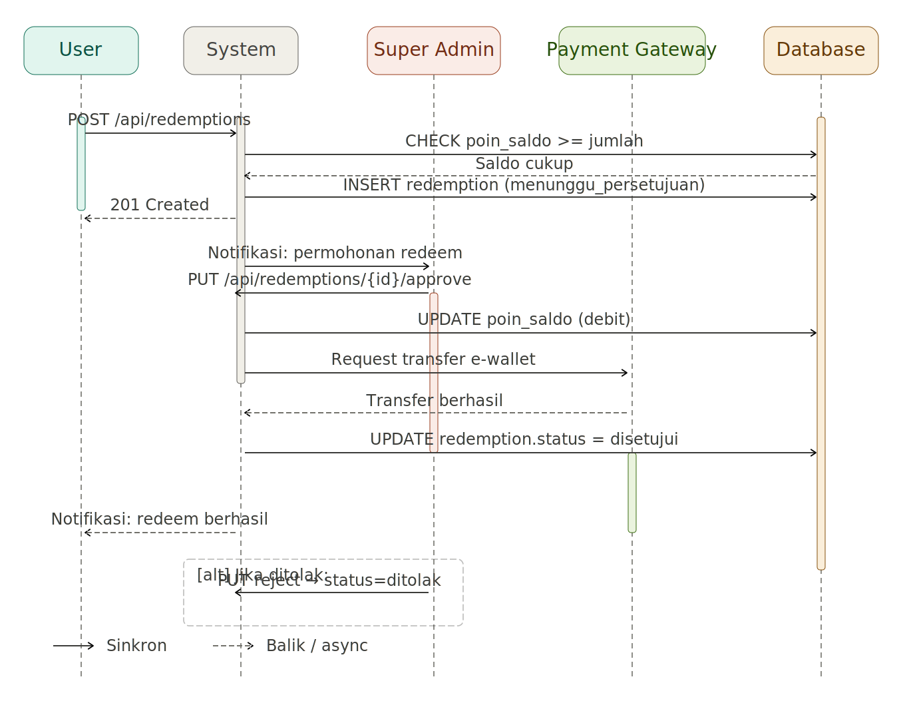
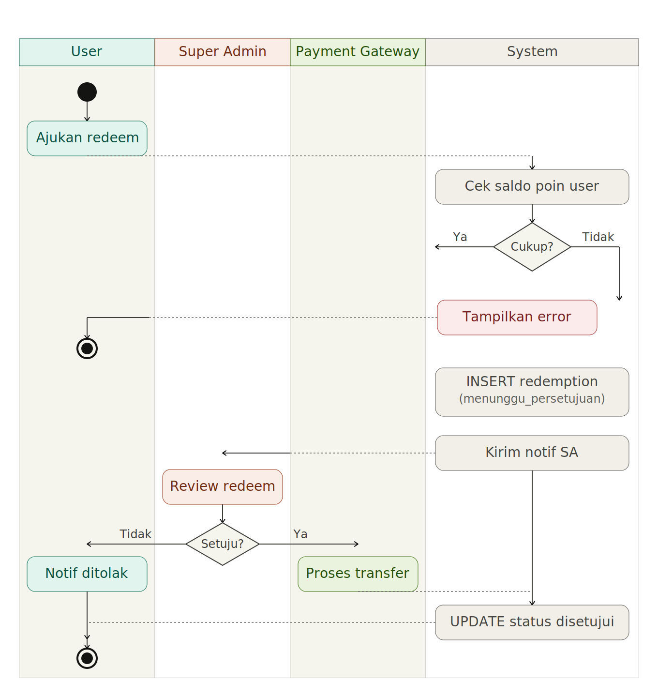
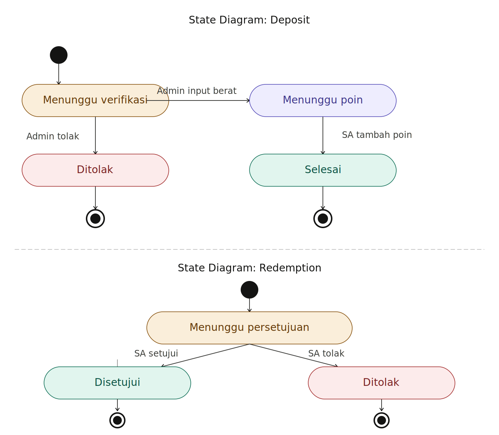
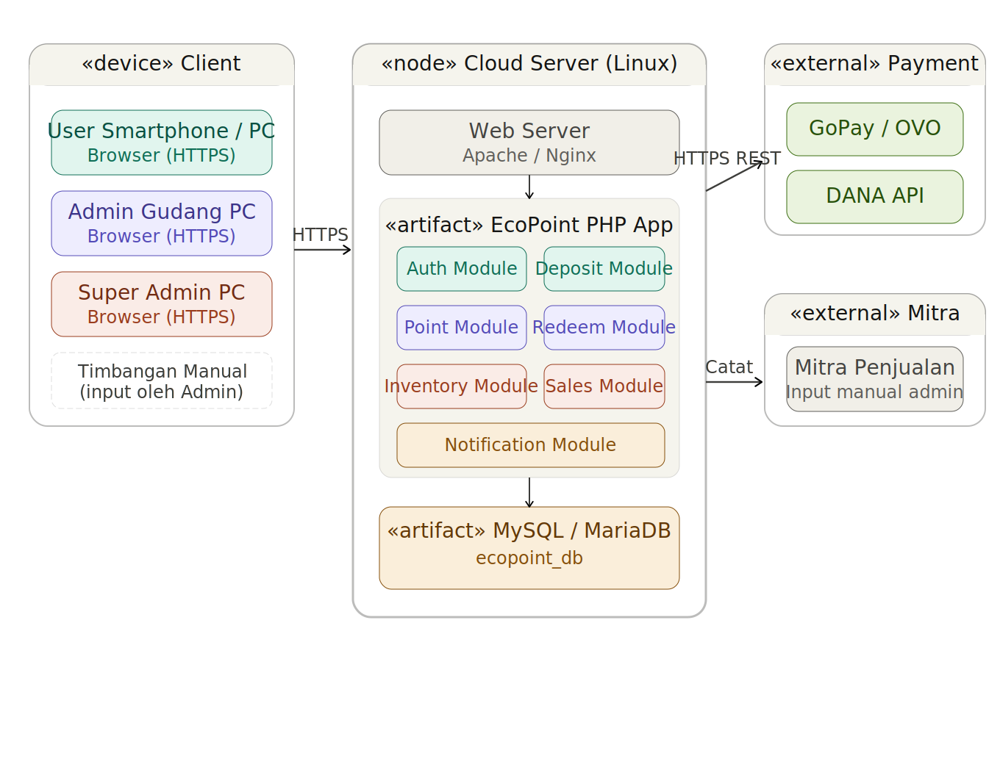

# Software Design Description
## EcoPoint — Sistem Informasi Daur Ulang Sampah Berbasis Poin

Version 2.0  
Prepared by Tim Pengembang EcoPoint  
Bandung, Jawa Barat, Indonesia  
Juni 2026

---

## Table of Contents

- [1. Introduction](#1-introduction)
  - [1.1 Document Purpose](#11-document-purpose)
  - [1.2 Subject Scope](#12-subject-scope)
  - [1.3 Definitions, Acronyms, and Abbreviations](#13-definitions-acronyms-and-abbreviations)
  - [1.4 References](#14-references)
  - [1.5 Document Overview](#15-document-overview)
- [2. Design Overview](#2-design-overview)
  - [2.1 Stakeholder Concerns](#21-stakeholder-concerns)
  - [2.2 Selected Viewpoints](#22-selected-viewpoints)
- [3. Design Views](#3-design-views)
  - [3.1 Context View — Use Case Diagram](#31-context-view--use-case-diagram)
  - [3.2 Composition View — Dekomposisi Komponen](#32-composition-view--dekomposisi-komponen)
  - [3.3 Logical View — Class Diagram](#33-logical-view--class-diagram)
  - [3.4 Information View — Skema Data Persisten](#34-information-view--skema-data-persisten)
  - [3.5 Interface View — REST API & UI Design](#35-interface-view--rest-api--ui-design)
  - [3.6 Interaction View — Sequence Diagram Setoran](#36-interaction-view--sequence-diagram-setoran)
  - [3.7 Interaction View — Sequence Diagram Redeem](#37-interaction-view--sequence-diagram-redeem)
  - [3.8 Algorithm View — Kalkulasi Poin](#38-algorithm-view--kalkulasi-poin)
  - [3.9 State Dynamics View — State Deposit & Redemption](#39-state-dynamics-view--state-deposit--redemption)
  - [3.10 Deployment View — Topologi Infrastruktur](#310-deployment-view--topologi-infrastruktur)
- [4. Decisions](#4-decisions)
  - [DEC-001: Arsitektur Web Monolitik Berbasis PHP](#dec-001-arsitektur-web-monolitik-berbasis-php)
  - [DEC-002: Basis Data Relasional MySQL/MariaDB](#dec-002-basis-data-relasional-mysqlmariadb)
  - [DEC-003: Penimbangan Manual oleh Admin Gudang](#dec-003-penimbangan-manual-oleh-admin-gudang)
- [5. Appendixes](#5-appendixes)
  - [Appendix A: Kelayakan TELOS](#appendix-a-kelayakan-telos)
  - [Appendix B: Tim Pengembang](#appendix-b-tim-pengembang)
  - [Appendix C: Spesifikasi Teknis Minimum](#appendix-c-spesifikasi-teknis-minimum)
  - [Appendix D: Timeline Pengembangan](#appendix-d-timeline-pengembangan)

---

## Revision History

| Name | Date | Reason For Changes | Version |
|------|------|--------------------|---------|
| Tim Pengembang EcoPoint | Juni 2026 | Dokumen awal | 1.0 |
| Tim Pengembang EcoPoint | Juni 2026 | Penambahan diagram UML ke dalam dokumen | 2.0 |

---

## 1. Introduction

### 1.1 Document Purpose

Dokumen *Software Design Description* (SDD) ini menjabarkan arsitektur dan rancangan teknis sistem **EcoPoint — Sistem Informasi Daur Ulang Sampah Berbasis Poin**. Dokumen ini ditujukan kepada tim pengembang (programmer, system analyst) sebagai acuan implementasi, kepada operator dan Super Admin sebagai referensi pemeliharaan, serta kepada pemangku kepentingan proyek untuk memahami keputusan desain yang diambil.

SDD ini disusun merujuk pada dokumen *Software Requirements Specification* (SRS) EcoPoint v1.0 dan mencakup seluruh komponen sistem yang harus diimplementasikan pada rilis pertama. Setiap keputusan desain signifikan didokumentasikan beserta konteks dan alasan pemilihannya.

### 1.2 Subject Scope

Sistem yang dirancang adalah **EcoPoint**, platform web responsif untuk manajemen bank sampah digital berbasis poin insentif. Tujuan utama sistem adalah mendigitalisasi seluruh alur kerja bank sampah: dari registrasi pengguna dan pengajuan setoran, penimbangan manual oleh Admin Gudang, pemberian poin oleh Super Admin, hingga pencairan poin dan penjualan inventori ke mitra.

**Kapabilitas utama yang dicakup SDD ini:**
- Manajemen akun dan autentikasi berbasis peran (User, Admin Gudang, Super Admin).
- Alur setoran sampah end-to-end dengan penimbangan manual.
- Kalkulasi dan distribusi poin berbasis konfigurasi harga per jenis sampah.
- Pencairan poin (redeem) ke e-wallet melalui Payment Gateway.
- Pengelolaan inventori gudang dan pencatatan penjualan ke mitra.

**Di luar cakupan SDD ini:** integrasi timbangan digital IoT, aplikasi mobile native, dan fitur analitik lanjutan (direncanakan untuk versi berikutnya).

### 1.3 Definitions, Acronyms, and Abbreviations

| Term | Definition |
|------|------------|
| **ACID** | Atomicity, Consistency, Isolation, Durability — properti transaksi basis data yang menjamin integritas data. |
| **Admin Gudang** | Petugas yang bertanggung jawab menimbang sampah secara manual dan menginput berat aktual ke sistem. |
| **API** | Application Programming Interface — antarmuka yang mendefinisikan cara komponen perangkat lunak berkomunikasi. |
| **Deposit** | Pengajuan setoran sampah yang dibuat pengguna sebelum mengantarkan sampah ke gudang. |
| **EcoPoint** | Sistem informasi daur ulang sampah berbasis poin digital yang didokumentasikan dalam SDD ini. |
| **GUI** | Graphical User Interface — antarmuka grafis yang digunakan pengguna untuk berinteraksi dengan sistem. |
| **Mitra** | Pihak eksternal (perusahaan daur ulang) yang membeli sampah terkumpul dari gudang bank sampah. |
| **Payment Gateway** | Layanan pihak ketiga (GoPay, OVO, DANA) yang memproses transfer dana saat poin diredeem. |
| **Poin** | Insentif digital yang diperoleh pengguna dari setoran sampah, dihitung berdasarkan berat × harga per kg × persentase insentif. |
| **RBAC** | Role-Based Access Control — mekanisme kontrol akses yang membatasi fungsi sistem berdasarkan peran pengguna. |
| **Redeem** | Proses pencairan poin menjadi nilai uang yang ditransfer ke e-wallet atau diambil tunai. |
| **SDD** | Software Design Description — dokumen ini. |
| **SRS** | Software Requirements Specification — dokumen spesifikasi kebutuhan fungsional dan non-fungsional EcoPoint. |
| **Super Admin** | Pengelola sistem tertinggi yang berwenang menambahkan poin, menyetujui redeem, dan mengatur konfigurasi. |
| **Timbangan Manual** | Timbangan konvensional (tidak terhubung jaringan) yang digunakan Admin Gudang; hasilnya diinput manual ke sistem. |
| **UML** | Unified Modeling Language — notasi standar untuk pemodelan sistem perangkat lunak. |

### 1.4 References

| No | Judul Dokumen | Penulis / Pemilik | Tipe |
|----|---------------|-------------------|------|
| 1 | Software Requirement Specification (SRS) EcoPoint v1.0 | Tim Pengembang EcoPoint, 2026 | Normatif |
| 2 | Studi Kelayakan & System Request EcoPoint | Tim Pengembang EcoPoint, 2026 | Normatif |
| 3 | UU No. 18 Tahun 2008 tentang Pengelolaan Sampah | Pemerintah Republik Indonesia, 2008 | Normatif |
| 4 | UU No. 27 Tahun 2022 tentang Perlindungan Data Pribadi | Pemerintah Republik Indonesia, 2022 | Normatif |
| 5 | ISO/IEC/IEEE 42010:2022 — Architecture Description | ISO/IEC/IEEE, 2022 | Informatif |

### 1.5 Document Overview

Dokumen ini terdiri dari lima bagian utama. **Bagian 1** menetapkan konteks, ruang lingkup, dan referensi. **Bagian 2** mendeskripsikan kekhawatiran pemangku kepentingan dan viewpoint yang dipilih untuk menjawab kekhawatiran tersebut. **Bagian 3** menyajikan design views secara rinci per viewpoint, masing-masing dilengkapi diagram UML. **Bagian 4** mendokumentasikan keputusan arsitektur signifikan dalam format terstruktur. **Bagian 5** memuat material pendukung.

Semua perubahan dokumen dicatat pada tabel Revision History. Referensi silang antara design views dan keputusan arsitektur ditandai dengan pengenal (mis. `→ DEC-001`).

---

## 2. Design Overview

### 2.1 Stakeholder Concerns

| Pemangku Kepentingan | Kekhawatiran Utama | Viewpoint yang Menjawab |
|---|---|---|
| **User (Pengguna)** | Kemudahan pengajuan setoran, transparansi saldo poin, kejelasan status setoran, kemudahan redeem | Context, Interface, Interaction, State Dynamics |
| **Admin Gudang** | Efisiensi input timbangan manual, kejelasan antrian setoran, kemudahan kelola inventori | Composition, Interaction, State Dynamics |
| **Super Admin** | Kontrol penambahan poin, approval redeem, keakuratan kalkulasi, laporan ringkas | Information, Algorithm, Interface, Interaction |
| **Tim Pengembang** | Modularitas kode, kejelasan model data, maintainability, deployment yang mudah | Logical, Information, Composition, Deployment |
| **Operator Sistem** | Keandalan operasional, kemudahan pemeliharaan, pemantauan infrastruktur | Deployment, Information |

### 2.2 Selected Viewpoints

#### 2.2.1 Context
**Addresses:** Batas-batas sistem EcoPoint, aktor eksternal (User, Admin Gudang, Super Admin, Payment Gateway, Mitra), dan layanan yang ditawarkan (use case).  
**Language:** UML Use Case Diagram.

#### 2.2.2 Composition
**Addresses:** Dekomposisi sistem ke dalam lapisan dan modul-modul fungsional, alokasi tanggung jawab per modul, titik integrasi eksternal.  
**Language:** Hierarchical Decomposition / Layer Diagram.

#### 2.2.3 Logical
**Addresses:** Struktur kelas/entitas domain, atribut, metode, dan relasi antar entitas; enkapsulasi dan ketergantungan.  
**Language:** UML Class Diagram.

#### 2.2.7 Information
**Addresses:** Struktur data persisten, skema tabel basis data, integritas referensial, manajemen transaksi ACID.  
**Language:** Entity-Relationship style, deskripsi skema.

#### 2.2.8 Interface
**Addresses:** Kontrak REST API antar komponen dan dengan sistem eksternal (Payment Gateway); desain layar antarmuka pengguna.  
**Language:** Tabel endpoint API, UI Screen Design.

#### 2.2.9 Interaction
**Addresses:** Alur kolaborasi runtime antar komponen pada skenario inti (setoran sampah, proses redeem); urutan pesan, penanganan error.  
**Language:** UML Sequence Diagram.

#### 2.2.10 Algorithm
**Addresses:** Logika kalkulasi poin (formula, langkah, penanganan edge case); psudocode proses tambah poin atomik.  
**Language:** Pseudocode, flowchart deskriptif.

#### 2.2.11 State Dynamics
**Addresses:** State dan transisi entitas Deposit dan Redemption sepanjang siklus hidupnya; guard condition dan efek transisi.  
**Language:** UML State Machine Diagram.

#### 2.2.14 Deployment
**Addresses:** Pemetaan komponen perangkat lunak ke node eksekusi (cloud server, browser, Payment Gateway); topologi komunikasi jaringan.  
**Language:** UML Deployment Diagram.

---

## 3. Design Views

---

### 3.1 Context View — Use Case Diagram

- **ID:** 001-context-use-case
- **Title:** Use Case Diagram Sistem EcoPoint
- **Viewpoint:** Context (2.2.1)
- **Representation:**

Sistem EcoPoint berinteraksi dengan lima aktor eksternal. **User** adalah pengguna akhir yang mendaftar, mengisi formulir setoran, memantau poin, dan mengajukan redeem. **Admin Gudang** menangani timbangan manual dan inventori. **Super Admin** mengontrol penambahan poin, konfigurasi harga, dan persetujuan redeem. **Payment Gateway** (GoPay/OVO/DANA) memproses transfer payout. **Mitra** adalah pembeli sampah terkumpul, dicatat oleh Admin Gudang.

**Relasi include:**
- `UC-09 Tambah Poin` **«include»** `UC-08 Review Data Timbangan` — Super Admin wajib meninjau data sebelum menambah poin.
- `UC-11 Setujui Redeem` **«include»** `UC-15 Proses Transfer E-Wallet` — persetujuan redeem memicu payout otomatis.

```
┌─────────────────────────────────────────────────────────────────────────┐
│                          « System »  EcoPoint                           │
│                                                                         │
│   (UC-01) Mendaftar Akun          (UC-08) Review Data Timbangan         │
│   (UC-02) Login                   (UC-09) Tambah Poin ke User           │
│   (UC-03) Isi Formulir Setoran    (UC-10) Kelola Harga & Insentif       │
│   (UC-04) Lihat Saldo & Riwayat   (UC-11) Setujui Redeem                │
│   (UC-05) Ajukan Redeem           (UC-12) Tolak Redeem                  │
│   (UC-06) Input Berat Aktual      (UC-13) Kelola Inventori              │
│   (UC-07) Tolak Setoran           (UC-14) Catat Penjualan Mitra         │
│                                   (UC-15) Proses Transfer E-Wallet      │
└─────────────────────────────────────────────────────────────────────────┘
        │  User: UC-01..05           │  Admin Gudang: UC-02,06,07,13,14
        │  Super Admin: UC-02,08..12 │  Payment Gateway: UC-15
        │  Mitra: (penerima data UC-14)
```

**Diagram UML:**



*Gambar 3.1 – Use Case Diagram Sistem EcoPoint*

- **More Information:** Use case ini mengacu pada SRS EcoPoint v1.0 Bagian 3. Lihat juga `→ DEC-001` untuk keputusan arsitektur yang mempengaruhi batasan sistem.

---

### 3.2 Composition View — Dekomposisi Komponen

- **ID:** 002-composition-layers
- **Title:** Dekomposisi Lapisan Arsitektur EcoPoint
- **Viewpoint:** Composition (2.2.2)
- **Representation:**

EcoPoint menggunakan arsitektur tiga lapisan (*three-tier*) dalam satu codebase monolitik PHP (`→ DEC-001`):

```
┌──────────────────────────────────────────────────────────────┐
│                   PRESENTATION LAYER                         │
│  ┌────────────┐ ┌──────────────┐ ┌────────────┐ ┌─────────┐  │
│  │ Auth Pages │ │ User Dash    │ │ Admin Panel│ │ SA Panel│  │
│  │ (login,    │ │ (saldo, form │ │ (timbang,  │ │ (poin,  │  │
│  │  register) │ │  setoran)    │ │  inventori)│ │  redeem)│  │
│  └────────────┘ └──────────────┘ └────────────┘ └─────────┘  │
└─────────────────────────────┬────────────────────────────────┘
                              │ HTTP Request / Response
┌─────────────────────────────▼────────────────────────────────┐
│                   BUSINESS LOGIC LAYER                       │
│  ┌────────────┐ ┌──────────┐ ┌──────────┐ ┌──────────────┐   │
│  │ Auth &     │ │ Deposit  │ │ Poin &   │ │  Redeem &    │   │
│  │ RBAC       │ │ Module   │ │ Kalkulasi│ │  Payout      │   │
│  └────────────┘ └──────────┘ └──────────┘ └──────────────┘   │
│  ┌────────────┐ ┌──────────┐ ┌──────────┐ ┌──────────────┐   │
│  │ Inventori  │ │ Penjualan│ │ Harga    │ │  Notifikasi  │   │
│  │ Module     │ │ Mitra    │ │ Config   │ │  Module      │   │
│  └────────────┘ └──────────┘ └──────────┘ └──────────────┘   │
└─────────────────────────────┬────────────────────────────────┘
                              │ SQL Query (PDO)
┌─────────────────────────────▼────────────────────────────────┐
│                      DATA LAYER                              │
│            MySQL / MariaDB (→ DEC-002)                       │
│  users · deposits · point_transactions · redemptions         │
│  inventory_items · partner_sales · price_settings            │
└──────────────────────────────────────────────────────────────┘
                              │
                   ┌──────────▼──────────┐
                   │  EXTERNAL SERVICES  │
                   │  Payment Gateway API│
                   │  (GoPay/OVO/DANA)   │
                   └─────────────────────┘
```

| Modul | Tanggung Jawab |
|-------|---------------|
| Auth & RBAC | Registrasi, login, session, validasi peran |
| Deposit Module | Buat setoran, update status, input berat aktual |
| Poin & Kalkulasi | Hitung poin, preview, tambah poin atomik |
| Redeem & Payout | Ajukan, setujui, tolak, trigger payment API |
| Inventori Module | Update stok setelah setoran selesai |
| Penjualan Mitra | Catat transaksi penjualan ke mitra |
| Harga Config | CRUD konfigurasi harga dan persentase insentif |
| Notifikasi | Kirim notif ke peran relevan pada setiap perubahan status |

- **More Information:** Keputusan monolitik didokumentasikan di `→ DEC-001`. Lapisan data mengikuti keputusan `→ DEC-002`.

---

### 3.3 Logical View — Class Diagram

- **ID:** 003-logical-class-diagram
- **Title:** Class Diagram Domain EcoPoint
- **Viewpoint:** Logical (2.2.3)
- **Representation:**

Berikut entitas domain utama beserta atribut, metode, dan relasi antar entitas:

**Entitas dan Atribut:**

| Class | Atribut Utama | Metode Utama |
|-------|--------------|--------------|
| **User** | id, nama, no_telepon, email, password_hash, poin_saldo, peran *(user\|admin_gudang\|super_admin)*, status *(aktif\|nonaktif)*, created_at | register(), login(), updateProfil(), lihatSaldo() |
| **Deposit** | id, user_id, jenis_sampah, estimasi_berat_kg, berat_aktual_kg, poin_diperoleh, status *(menunggu_verifikasi\|menunggu_poin\|selesai\|ditolak)*, admin_gudang_id, super_admin_id, catatan, created_at | buat(), inputBeratAktual(), tolak(), selesaikan() |
| **PointTransaction** | id, user_id, deposit_id, tipe *(kredit\|debit)*, jumlah_poin, ditambahkan_oleh, keterangan, created_at | catat(), riwayatByUser() |
| **Redemption** | id, user_id, jumlah_poin, metode *(ewallet\|tunai)*, no_ewallet, status *(menunggu_persetujuan\|disetujui\|ditolak)*, diproses_oleh, keterangan_tolak, created_at | ajukan(), setujui(), tolak() |
| **InventoryItem** | id, jenis_sampah, jumlah_kg, status_stok *(tersedia\|habis)*, admin_id, updated_at | tambahStok(), kurangiStok(), lihat() |
| **PartnerSale** | id, jenis_sampah, jumlah_kg, harga_jual_per_kg, total_nilai, mitra_tujuan, admin_id, tanggal_penjualan | catat(), laporan() |
| **PriceSetting** | id, jenis_sampah, harga_per_kg, persentase_insentif, updated_by, updated_at | update(), getHargaAktif() |

**Diagram UML Class:**

```
┌─────────────────────────────────┐
│            User                 │
├─────────────────────────────────┤
│ + id: int (PK)                  │
│ + nama: string                  │
│ + no_telepon: string            │
│ + email: string (UNIQUE)        │
│ + password_hash: string         │
│ + poin_saldo: int               │
│ + peran: enum                   │
│ + status: enum                  │
│ + created_at: datetime          │
├─────────────────────────────────┤
│ + register()                    │
│ + login()                       │
│ + updateProfil()                │
│ + lihatSaldo()                  │
└───────┬─────────────────────────┘
        │ 1                    1
        │ creates              processes
        ▼ N                    N ▼
┌───────────────────────┐   ┌───────────────────────┐
│       Deposit         │   │      Redemption       │
├───────────────────────┤   ├───────────────────────┤
│ + id: int (PK)        │   │ + id: int (PK)        │
│ + user_id: int (FK)   │   │ + user_id: int (FK)   │
│ + jenis_sampah: string│   │ + jumlah_poin: int    │
│ + estimasi_berat_kg   │   │ + metode: enum        │
│ + berat_aktual_kg     │   │ + no_ewallet: string  │
│ + poin_diperoleh: int │   │ + status: enum        │
│ + status: enum        │   │ + diproses_oleh: int  │
│ + admin_gudang_id: int│   │ + created_at: datetime│
│ + super_admin_id: int │   ├───────────────────────┤
│ + catatan: text       │   │ + ajukan()            │
│ + created_at: datetime│   │ + setujui()           │
├───────────────────────┤   │ + tolak()             │
│ + buat()              │   └───────────────────────┘
│ + inputBeratAktual()  │
│ + tolak()             │ 1
│ + selesaikan()        ├────────────────────┐
└───────┬───────────────┘ generates 0..1     │
        │ references 1                       ▼
        ▼ N                    ┌─────────────────────────┐
┌────────────────────┐         │    PointTransaction     │
│   PriceSetting     │         ├─────────────────────────┤
├────────────────────┤         │ + id: int (PK)          │
│ + id: int (PK)     │         │ + user_id: int (FK)     │
│ + jenis_sampah     │         │ + deposit_id: int (FK)  │
│ + harga_per_kg     │         │ + tipe: enum            │
│ + persen_insentif  │         │ + jumlah_poin: int      │
│ + updated_by: int  │         │ + ditambahkan_oleh: int │
│ + updated_at       │         │ + keterangan: string    │
├────────────────────┤         │ + created_at: datetime  │
│ + update()         │         ├─────────────────────────┤
│ + getHargaAktif()  │         │ + catat()               │
└────────────────────┘         │ + riwayatByUser()       │
                               └─────────────────────────┘

┌─────────────────────────┐     ┌─────────────────────────┐
│     InventoryItem       │     │      PartnerSale        │
├─────────────────────────┤     ├─────────────────────────┤
│ + id: int (PK)          │ 1 N │ + id: int (PK)          │
│ + jenis_sampah: string  ├────►│ + jenis_sampah: string  │
│ + jumlah_kg: decimal    │     │ + jumlah_kg: decimal    │
│ + status_stok: enum     │     │ + harga_jual_per_kg     │
│ + admin_id: int (FK)    │     │ + total_nilai: decimal  │
│ + updated_at: datetime  │     │ + mitra_tujuan: string  │
├─────────────────────────┤     │ + admin_id: int (FK)    │
│ + tambahStok()          │     │ + tanggal_penjualan     │
│ + kurangiStok()         │     ├─────────────────────────┤
│ + lihat()               │     │ + catat()               │
└─────────────────────────┘     │ + laporan()             │
                                └─────────────────────────┘
```



*Gambar 3.3 – Class Diagram Domain EcoPoint*

**Ringkasan Relasi:**

| Relasi | Kardinalitas |
|--------|-------------|
| User → Deposit | 1 : N |
| User → Redemption | 1 : N |
| User → PointTransaction | 1 : N |
| Deposit → PointTransaction | 1 : 0..1 |
| PriceSetting → Deposit | 1 : N |
| InventoryItem → PartnerSale | 1 : N |

- **More Information:** Entitas ini dipetakan langsung ke tabel pada Data Layer (lihat `3.4 Information View`).

---

### 3.4 Information View — Skema Data Persisten

- **ID:** 004-information-schema
- **Title:** Skema Basis Data EcoPoint
- **Viewpoint:** Information (2.2.7)
- **Representation:**

Basis data menggunakan MySQL/MariaDB (`→ DEC-002`). Tujuh tabel persisten utama:

**Skema Ringkas:**

```sql
-- Tabel 1: users
users (
  id            INT PRIMARY KEY AUTO_INCREMENT,
  nama          VARCHAR(100) NOT NULL,
  no_telepon    VARCHAR(20),
  email         VARCHAR(100) NOT NULL UNIQUE,
  password_hash VARCHAR(255) NOT NULL,
  poin_saldo    INT NOT NULL DEFAULT 0,
  peran         ENUM('user','admin_gudang','super_admin') NOT NULL,
  status        ENUM('aktif','nonaktif') NOT NULL DEFAULT 'aktif',
  created_at    DATETIME DEFAULT CURRENT_TIMESTAMP
)

-- Tabel 2: deposits
deposits (
  id                   INT PRIMARY KEY AUTO_INCREMENT,
  user_id              INT NOT NULL,  -- FK → users.id
  jenis_sampah         VARCHAR(50) NOT NULL,
  estimasi_berat_kg    DECIMAL(8,2),
  berat_aktual_kg      DECIMAL(8,2),
  poin_diperoleh       INT DEFAULT 0,
  status               ENUM('menunggu_verifikasi','menunggu_poin','selesai','ditolak') NOT NULL,
  admin_gudang_id      INT,           -- FK → users.id
  super_admin_id       INT,           -- FK → users.id
  catatan              TEXT,
  created_at           DATETIME DEFAULT CURRENT_TIMESTAMP
)

-- Tabel 3: point_transactions
point_transactions (
  id               INT PRIMARY KEY AUTO_INCREMENT,
  user_id          INT NOT NULL,  -- FK → users.id
  deposit_id       INT,           -- FK → deposits.id (nullable untuk debit redeem)
  tipe             ENUM('kredit','debit') NOT NULL,
  jumlah_poin      INT NOT NULL,
  ditambahkan_oleh INT NOT NULL,  -- FK → users.id
  keterangan       VARCHAR(255),
  created_at       DATETIME DEFAULT CURRENT_TIMESTAMP
)

-- Tabel 4: redemptions
redemptions (
  id               INT PRIMARY KEY AUTO_INCREMENT,
  user_id          INT NOT NULL,  -- FK → users.id
  jumlah_poin      INT NOT NULL,
  metode           ENUM('ewallet','tunai') NOT NULL,
  no_ewallet       VARCHAR(50),
  status           ENUM('menunggu_persetujuan','disetujui','ditolak') NOT NULL,
  diproses_oleh    INT,           -- FK → users.id
  keterangan_tolak TEXT,
  created_at       DATETIME DEFAULT CURRENT_TIMESTAMP
)

-- Tabel 5: inventory_items
inventory_items (
  id           INT PRIMARY KEY AUTO_INCREMENT,
  jenis_sampah VARCHAR(50) NOT NULL UNIQUE,
  jumlah_kg    DECIMAL(10,2) NOT NULL DEFAULT 0,
  status_stok  ENUM('tersedia','habis') NOT NULL DEFAULT 'tersedia',
  admin_id     INT,  -- FK → users.id
  updated_at   DATETIME ON UPDATE CURRENT_TIMESTAMP
)

-- Tabel 6: partner_sales
partner_sales (
  id                INT PRIMARY KEY AUTO_INCREMENT,
  jenis_sampah      VARCHAR(50) NOT NULL,
  jumlah_kg         DECIMAL(10,2) NOT NULL,
  harga_jual_per_kg DECIMAL(12,2) NOT NULL,
  total_nilai       DECIMAL(14,2) NOT NULL,
  mitra_tujuan      VARCHAR(100) NOT NULL,
  admin_id          INT NOT NULL,  -- FK → users.id
  tanggal_penjualan DATE NOT NULL
)

-- Tabel 7: price_settings
price_settings (
  id                  INT PRIMARY KEY AUTO_INCREMENT,
  jenis_sampah        VARCHAR(50) NOT NULL UNIQUE,
  harga_per_kg        DECIMAL(12,2) NOT NULL,
  persentase_insentif DECIMAL(5,2) NOT NULL,
  updated_by          INT NOT NULL,  -- FK → users.id
  updated_at          DATETIME ON UPDATE CURRENT_TIMESTAMP
)
```

**Prinsip Integritas Data:**

| Prinsip | Implementasi |
|---------|-------------|
| Referential Integrity | `FOREIGN KEY` pada seluruh relasi antar tabel |
| Not Null | Semua atribut wajib dikodekan `NOT NULL` |
| Unique Email | `UNIQUE` pada `users.email` |
| Enum Status | Field status menggunakan `ENUM` untuk membatasi nilai valid |
| ACID Transaction | Proses tambah poin dan proses redeem dieksekusi dalam satu `BEGIN...COMMIT` |
| Soft Delete | Pengguna nonaktif mengubah `status = 'nonaktif'`, tidak dihapus fisik |

- **More Information:** Keputusan pemilihan MySQL/MariaDB di `→ DEC-002`.

---

### 3.5 Interface View — REST API & UI Design

- **ID:** 005-interface-api-ui
- **Title:** REST API Endpoints dan Desain Layar Utama
- **Viewpoint:** Interface (2.2.8)
- **Representation:**

#### Endpoint REST API

Seluruh endpoint menggunakan prefix `/api/v1/` dan mengembalikan JSON. Autentikasi menggunakan Bearer Token (session-based). Format response standar:

```json
{ "success": true,  "message": "...", "data": { ... } }
{ "success": false, "message": "...", "errors": { ... } }
```

| Method | Endpoint | Deskripsi | Peran |
|--------|----------|-----------|-------|
| `POST` | `/auth/register` | Registrasi akun baru | Publik |
| `POST` | `/auth/login` | Login, mendapat session token | Semua |
| `POST` | `/auth/logout` | Mengakhiri sesi | Semua |
| `GET`  | `/users/me` | Profil dan saldo poin terkini | User |
| `POST` | `/deposits` | Membuat pengajuan setoran | User |
| `GET`  | `/deposits` | Daftar setoran (difilter per peran) | Semua |
| `GET`  | `/deposits/{id}` | Detail setoran | Semua |
| `POST` | `/deposits/{id}/weigh` | Input berat aktual | Admin Gudang |
| `POST` | `/deposits/{id}/reject` | Menolak setoran | Admin Gudang |
| `POST` | `/deposits/{id}/add-points` | Menambah poin ke user | Super Admin |
| `POST` | `/redemptions` | Mengajukan redeem | User |
| `GET`  | `/redemptions` | Daftar pengajuan redeem | User / SA |
| `PUT`  | `/redemptions/{id}/approve` | Menyetujui redeem | Super Admin |
| `PUT`  | `/redemptions/{id}/reject` | Menolak redeem | Super Admin |
| `GET`  | `/inventory` | Melihat stok inventori | AG / SA |
| `PUT`  | `/inventory/{id}` | Update stok | Admin Gudang |
| `POST` | `/inventory/sell` | Catat penjualan ke mitra | Admin Gudang |
| `GET`  | `/price-settings` | Lihat konfigurasi harga | Super Admin |
| `PUT`  | `/price-settings/{id}` | Update konfigurasi harga | Super Admin |

#### Desain Layar Utama (UI Screen Design)

**1 — Dashboard User**
```
┌─────────────────────────────────────────────────────────┐
│  EcoPoint        [Halo, Budi] [🔔 Notifikasi] [Keluar] │
├─────────────────┬─────────────────┬─────────────────────┤
│ 💰 Saldo Poin   │  📦 Setoran    │ 🔄 Redeem Terakhir │
│   12.500 poin   │  Aktif: 2       │  Status: Menunggu   │
├─────────────────┴─────────────────┴─────────────────────┤
│  [+ Buat Setoran Baru]                                  │
├─────────────────────────────────────────────────────────┤
│  Riwayat Setoran                                        │
│  ┌──────┬─────────┬────────┬────────┬─────────────────┐ │
│  │  ID  │  Jenis  │  Berat │  Poin  │     Status      │ │
│  ├──────┼─────────┼────────┼────────┼─────────────────┤ │
│  │ #042 │ Plastik │ 3.5 kg │  3.500 │ ✅ Selesai      │ │
│  │ #041 │ Kertas  │ 2.0 kg │  1.800 │ ⏳ Menunggu Poin│ │
│  └──────┴─────────┴────────┴────────┴─────────────────┘ │
└─────────────────────────────────────────────────────────┘
```

**2 — Form Setoran User**
```
┌─────────────────────────────────────────────────────────┐
│  Buat Setoran Baru                                      │
├─────────────────────────────────────────────────────────┤
│  Jenis Sampah:   [Pilih jenis ▼]                        │
│                  Plastik / Kertas / Logam / Kaca / Lain │
│  Estimasi Berat: [______] kg                            │
│  Catatan:        [________________________________]     │
│                  [________________________________]     │
│                                                         │
│ ℹ️  Bawa sampah ke gudang setelah mengirim formulir ini │
│                                                         │
│  [Simpan Draft]                [Kirim Setoran →]        │
└─────────────────────────────────────────────────────────┘
```

**3 — Panel Admin Gudang**
```
┌─────────────────────────────────────────────────────────┐
│  Panel Admin Gudang                   [Inventori Stok]  │
├────────────────────────┬────────────────────────────────┤
│  ANTRIAN SETORAN       │  DETAIL SETORAN #041           │
│  ┌───────────────────┐ │  User  : Budi Santoso          │
│  │ #041 - Kertas     │ │  Jenis : Kertas                │
│  │ Budi S. - 2 kg    │◄│  Est.  : 2.0 kg                │
│  │ [Pilih]           │ │  Status: Menunggu Verifikasi   │
│  ├───────────────────┤ │                                │
│  │ #040 - Plastik    │ │  Berat Aktual: [______] kg     │
│  │ Ani R. - 5 kg     │ │                                │
│  │ [Pilih]           │ │  [Simpan Berat] [Tolak]        │
│  └───────────────────┘ │                                │
└────────────────────────┴────────────────────────────────┘
```

**4 — Panel Super Admin**
```
┌─────────────────────────────────────────────────────────┐
│  Panel Super Admin                                      │
├─────────────────────────────────────────────────────────┤
│  SETORAN MENUNGGU POIN                                  │
│  ┌───────┬───────────┬────────┬──────────┬───────────┐  │
│  │  ID   │   User    │ Jenis  │  Berat   │  Preview  │  │
│  ├───────┼───────────┼────────┼──────────┼───────────┤  │
│  │ #041  │ Budi S.   │ Kertas │ 1.8 kg   │ 1.620 poin│  │
│  │       │           │        │          │[Tambah Poin]│ │
│  └───────┴───────────┴────────┴──────────┴───────────┘  │
│                                                         │
│  REDEEM MENUNGGU PERSETUJUAN                            │
│  ┌───────┬───────────┬────────┬──────────┬───────────┐  │
│  │  ID   │   User    │  Poin  │  Metode  │  Aksi     │  │
│  ├───────┼───────────┼────────┼──────────┼───────────┤  │
│  │ #018  │ Rina M.   │ 5.000  │ GoPay    │[✓][✗]     │  │
│  └───────┴───────────┴────────┴──────────┴───────────┘  │
└─────────────────────────────────────────────────────────┘
```

- **More Information:** Endpoint `/deposits/{id}/add-points` mengimplementasikan algoritma di `3.8 Algorithm View`. Transisi status yang dipicu oleh endpoint ini terdokumentasi di `3.9 State Dynamics View`.

---

### 3.6 Interaction View — Sequence Diagram Setoran

- **ID:** 006-interaction-deposit-sequence
- **Title:** Sequence Diagram — Alur Setoran Sampah End-to-End
- **Viewpoint:** Interaction (2.2.9)
- **Representation:**

Skenario: User mengajukan setoran → Admin Gudang menginput berat → Super Admin menambah poin.

```
User          Sistem        Admin Gudang     Super Admin    DB
 │                │                │                │        │
 │──[1] POST /deposits ──────────►│                │        │
 │                │── INSERT deposit (status=menunggu_verif) ►│
 │◄── 201 Created ┤                │                │        │
 │                │                │                │        │
 │  (User antar sampah ke gudang — di luar sistem)  │        │
 │                │                │                │        │
 │                │◄─[4] POST /deposits/{id}/weigh ─┤        │
 │                │── UPDATE deposits.berat_aktual ──────────►│
 │                │── UPDATE deposits.status                  │
 │                │   → 'menunggu_poin' ─────────────────────►│
 │                │── INSERT notifikasi → Super Admin ───────►│
 │                │─────────────────────────────────►[7] Notif│
 │                │                │                │        │
 │                │                │◄─[8] GET /deposits/{id} ┤
 │                │── SELECT deposits + price_settings ───────►│
 │                │◄── data deposit + preview poin ──────────┤│
 │                │─────────────────────────────────►[preview]│
 │                │                │                │        │
 │                │◄─[10] POST /deposits/{id}/add-points ─────┤
 │                │                │                │        │
 │                │──[11] BEGIN TRANSACTION ─────────────────►│
 │                │── UPDATE users SET poin_saldo += X ───────►│
 │                │── INSERT point_transactions ──────────────►│
 │                │── UPDATE deposits.status → 'selesai' ─────►│
 │                │── UPDATE inventory_items.jumlah_kg += Y ──►│
 │                │── COMMIT ────────────────────────────────►│
 │                │                │                │        │
 │◄─[12] Notifikasi sukses ─────────────────────────┤        │
 │                │                │                │        │

KETERANGAN:
[1]  User POST formulir setoran → sistem simpan status menunggu_verifikasi
[4]  Admin Gudang input berat aktual → status → menunggu_poin + notif SA
[8]  Super Admin review data deposit + kalkulasi preview poin
[10] Super Admin konfirmasi tambah poin
[11] Transaksi atomik ACID: update saldo, catat PointTransaction,
     update status deposit, update inventori
[12] User terima notifikasi poin masuk
```

**Failure Path — Transaksi Gagal di Langkah 11:**
```
[11] BEGIN TRANSACTION
     ... (salah satu query gagal) ...
     ROLLBACK → seluruh perubahan dibatalkan
→ Sistem return error 500, Super Admin diminta coba lagi
→ Status deposit tetap 'menunggu_poin'
```



*Gambar 3.6 – Sequence Diagram Alur Setoran Sampah End-to-End*



*Gambar 3.6b – Activity Diagram Alur Setoran Sampah*

- **More Information:** Algoritma kalkulasi poin pada langkah preview [8] dan [11] didokumentasikan di `3.8 Algorithm View`. State transisi deposit didokumentasikan di `3.9 State Dynamics View`. Keputusan penimbangan manual di `→ DEC-003`.

---

### 3.7 Interaction View — Sequence Diagram Redeem

- **ID:** 007-interaction-redeem-sequence
- **Title:** Sequence Diagram — Alur Pencairan Poin (Redeem)
- **Viewpoint:** Interaction (2.2.9)
- **Representation:**

Skenario happy path: User ajukan redeem → Super Admin setujui → Payment Gateway sukses.

```
User          Sistem        Super Admin    Payment GW     DB
 │                │                │             │         │
 │──[1] POST /redemptions ────────►│             │         │
 │                │── Cek: poin_saldo >= jumlah_poin ──────►│
 │                │   [VALID] INSERT redemptions             │
 │                │   (status=menunggu_persetujuan) ────────►│
 │                │── INSERT notifikasi → Super Admin ──────►│
 │◄── 201 Created ┤                │             │         │
 │                │◄─[3] GET /redemptions ────────┤         │
 │                │── SELECT pending redemptions ──────────►│
 │                │─────────────────────────────►[daftar]   │
 │                │◄─[4] PUT /redemptions/{id}/approve ──────┤
 │                │                │             │         │
 │                │──[5] POST /api/payment-gateway ────────►│
 │                │                │◄── [6] {status: sukses}│
 │                │                │             │         │
 │                │──[7] BEGIN TRANSACTION ────────────────►│
 │                │── UPDATE users SET poin_saldo -= X ─────►│
 │                │── INSERT point_transactions (debit) ─────►│
 │                │── UPDATE redemptions.status → 'disetujui'►│
 │                │── COMMIT ──────────────────────────────►│
 │◄─[8] Notifikasi redeem berhasil ──────────────┤         │
 │                │                │             │         │

FAILURE PATH — Payment Gateway Gagal di Langkah 6:
[6]  Payment Gateway return {status: gagal / timeout}
[7]  Sistem TIDAK mendebit poin
     UPDATE redemptions.status → 'gagal_transfer'
→ Super Admin menerima notifikasi gagal, dapat retry
→ Saldo poin user tidak berubah

FAILURE PATH — Poin Tidak Cukup di Langkah 1:
[1]  Cek: poin_saldo < jumlah_poin → Return 422 Unprocessable
→ User menerima pesan "Saldo poin tidak mencukupi"
```



*Gambar 3.7 – Sequence Diagram Alur Pencairan Poin (Redeem)*



*Gambar 3.7b – Activity Diagram Alur Pencairan Poin (Redeem)*

- **More Information:** State transisi Redemption pada sequence ini terdokumentasi di `3.9 State Dynamics View`.

---

### 3.8 Algorithm View — Kalkulasi Poin

- **ID:** 008-algorithm-point-calculation
- **Title:** Algoritma Kalkulasi dan Penambahan Poin
- **Viewpoint:** Algorithm (2.2.10)
- **Representation:**

**Formula utama:**

```
Nilai Sampah (Rp) = berat_aktual_kg × harga_per_kg
Poin              = ROUND(Nilai Sampah × (persentase_insentif / 100))
```

**Contoh kalkulasi:**

| Jenis Sampah | Berat Aktual | Harga/kg | Insentif | Poin |
|---|---|---|---|---|
| Plastik | 5.0 kg | Rp 2.000 | 50% | `ROUND(5 × 2000 × 0.5)` = **5.000** |
| Kertas | 1.8 kg | Rp 1.500 | 60% | `ROUND(1.8 × 1500 × 0.6)` = **1.620** |
| Logam | 2.3 kg | Rp 5.000 | 40% | `ROUND(2.3 × 5000 × 0.4)` = **4.600** |

**Pseudocode fungsi `tambahPoin(depositId, superAdminId)`:**

```
FUNCTION tambahPoin(depositId, superAdminId):

  // === VALIDASI INPUT ===
  deposit ← SELECT * FROM deposits
             WHERE id = depositId AND status = 'menunggu_poin'
  IF deposit IS NULL THEN
    RETURN Error(422, "Deposit tidak valid atau status tidak sesuai")
  END IF

  price ← SELECT * FROM price_settings
           WHERE jenis_sampah = deposit.jenis_sampah
  IF price IS NULL THEN
    RETURN Error(422, "Konfigurasi harga tidak tersedia untuk jenis sampah ini")
  END IF

  IF deposit.berat_aktual_kg <= 0 THEN
    RETURN Error(422, "Berat aktual tidak valid")
  END IF

  // === KALKULASI ===
  nilaiSampah ← deposit.berat_aktual_kg × price.harga_per_kg
  jumlahPoin  ← ROUND(nilaiSampah × (price.persentase_insentif / 100))

  // === PREVIEW (dikembalikan ke Super Admin sebelum konfirmasi) ===
  RETURN Preview {
    deposit_id    : depositId,
    jenis_sampah  : deposit.jenis_sampah,
    berat_aktual  : deposit.berat_aktual_kg,
    harga_per_kg  : price.harga_per_kg,
    persentase    : price.persentase_insentif,
    nilai_sampah  : nilaiSampah,
    jumlah_poin   : jumlahPoin
  }

FUNCTION konfirmasiTambahPoin(depositId, jumlahPoin, superAdminId):

  // === TRANSAKSI ATOMIK ===
  BEGIN TRANSACTION

    [a] UPDATE users
        SET poin_saldo = poin_saldo + jumlahPoin
        WHERE id = deposit.user_id

    [b] INSERT INTO point_transactions
        (user_id, deposit_id, tipe, jumlah_poin, ditambahkan_oleh, keterangan)
        VALUES (deposit.user_id, depositId, 'kredit', jumlahPoin,
                superAdminId, 'Setoran sampah diverifikasi')

    [c] UPDATE deposits
        SET status = 'selesai',
            poin_diperoleh = jumlahPoin,
            super_admin_id = superAdminId
        WHERE id = depositId

    [d] UPDATE inventory_items
        SET jumlah_kg = jumlah_kg + deposit.berat_aktual_kg,
            status_stok = 'tersedia'
        WHERE jenis_sampah = deposit.jenis_sampah

  COMMIT
  kirimNotifikasi(deposit.user_id, "Poin " + jumlahPoin + " telah dikreditkan")
  RETURN Success(200, "Poin berhasil ditambahkan")

  ON ERROR:
    ROLLBACK
    RETURN Error(500, "Gagal memproses poin. Silakan coba lagi.")
```

**Edge Cases yang ditangani:**

| Kondisi | Penanganan |
|---------|-----------|
| `berat_aktual_kg = 0` | Validasi pre-query, return 422 |
| Harga jenis sampah belum dikonfigurasi | Validasi pre-query, return 422 |
| Deposit sudah berstatus `selesai` | Validasi status, return 422 (idempotency guard) |
| Salah satu query dalam transaksi gagal | ROLLBACK, return 500, tidak ada perubahan parsial |
| Hasil kalkulasi < 1 poin | ROUND menghasilkan 0; sistem tetap mencatat PointTransaction dengan jumlah 0 |

- **More Information:** Fungsi ini dipanggil dari endpoint `POST /deposits/{id}/add-points` (lihat `3.5`). Efek pada state deposit di `3.9`.

---

### 3.9 State Dynamics View — State Deposit & Redemption

- **ID:** 009-state-deposit-redemption
- **Title:** State Machine Diagram — Deposit dan Redemption
- **Viewpoint:** State Dynamics (2.2.11)
- **Representation:**

#### State Machine — Deposit

```
                    ┌─────────┐
                    │  AWAL   │
                    └────┬────┘
                         │ User berhasil POST /deposits
                         ▼
              ┌──────────────────────┐
              │  menunggu_verifikasi │
              │  (Deposit dibuat,    │
              │   menunggu AG input) │
              └────────┬─────────────┘
                       │                    │
     Admin Gudang       │                    │ Admin Gudang
     POST /weigh        │                    │ POST /reject
         ──────────────►│                    │◄───────────
                        ▼                    ▼
           ┌────────────────────┐    ┌─────────────┐
           │   menunggu_poin    │    │  ditolak    │
           │ (Berat aktual ada, │    │  (Terminal) │
           │  menunggu SA poin) │    └─────────────┘
           └─────────┬──────────┘
                     │
        Super Admin POST /add-points
        (konfirmasiTambahPoin berhasil)
                     │
                     ▼
            ┌────────────────┐
            │    selesai     │
            │   (Terminal)   │
            └────────────────┘
```



*Gambar 3.9 – State Machine Diagram Deposit dan Redemption*

**Tabel Transisi State Deposit:**

| State Asal | Event / Guard | State Tujuan | Efek Samping |
|------------|---------------|-------------|-------------|
| *(init)* | User POST /deposits | `menunggu_verifikasi` | — |
| `menunggu_verifikasi` | AG input berat aktual > 0 | `menunggu_poin` | Kirim notif ke SA |
| `menunggu_verifikasi` | AG tolak setoran | `ditolak` | Kirim notif ke User |
| `menunggu_poin` | SA konfirmasi tambah poin | `selesai` | Debit kredit poin, update inventori, notif User |

#### State Machine — Redemption

```
                    ┌─────────┐
                    │  AWAL   │
                    └────┬────┘
                         │ User POST /redemptions
                         │ [guard: poin_saldo >= jumlah_poin]
                         ▼
              ┌──────────────────────────┐
              │  menunggu_persetujuan    │
              │  (Redeem diajukan,       │
              │   menunggu SA approval)  │
              └────┬─────────────────────┘
                   │                        │
  SA PUT /approve  │                        │ SA PUT /reject
  + PG sukses      │                        │
       ────────────►│                        │◄────────────
                    ▼                        ▼
          ┌──────────────────┐     ┌──────────────────┐
          │    disetujui     │     │     ditolak      │
          │  Poin didebit,   │     │   (Terminal)     │
          │  transfer sukses │     └──────────────────┘
          │   (Terminal)     │
          └──────────────────┘
                   │
          [Payment GW gagal]
                   │
                   ▼
          ┌──────────────────┐
          │  gagal_transfer  │
          │  (SA dapat retry)│
          └──────────────────┘
```

**Tabel Transisi State Redemption:**

| State Asal | Event / Guard | State Tujuan | Efek Samping |
|------------|---------------|-------------|-------------|
| *(init)* | User POST, saldo cukup | `menunggu_persetujuan` | Notif ke SA |
| *(init)* | User POST, saldo tidak cukup | *(ditolak sistem, tidak tersimpan)* | Return 422 |
| `menunggu_persetujuan` | SA setujui + PG sukses | `disetujui` | Debit poin User, notif sukses |
| `menunggu_persetujuan` | SA setujui + PG gagal | `gagal_transfer` | Poin tidak didebit, notif SA |
| `menunggu_persetujuan` | SA tolak | `ditolak` | Notif User |
| `gagal_transfer` | SA retry + PG sukses | `disetujui` | Debit poin, notif sukses |

- **More Information:** State `selesai` dan `disetujui` memicu pembaruan `PointTransaction` (lihat `3.3 Logical View`). Transisi ini dipicu oleh endpoint di `3.5 Interface View`.

---

### 3.10 Deployment View — Topologi Infrastruktur

- **ID:** 010-deployment-topology
- **Title:** Deployment Diagram EcoPoint
- **Viewpoint:** Deployment (2.2.14)
- **Representation:**

```
┌─────────────────────────────────────────────────────────────────┐
│                        INTERNET                                 │
│                                                                 │
│  ┌──────────────┐   ┌──────────────┐   ┌──────────────┐        │
│  │ Perangkat    │   │ Perangkat    │   │ Perangkat    │        │
│  │ User         │   │ Admin Gudang │   │ Super Admin  │        │
│  │              │   │              │   │              │        │
│  │ Browser      │   │ Browser      │   │ Browser      │        │
│  │ (Chrome/FF/  │   │ (Chrome/FF)  │   │ (Chrome/FF)  │        │
│  │  Safari)     │   │              │   │              │        │
│  └──────┬───────┘   └──────┬───────┘   └──────┬───────┘        │
│         │                  │                  │                 │
│         └──────────────────┼──────────────────┘                 │
│                            │ HTTPS (TLS 1.2+)                   │
│                            │                                    │
│              ┌─────────────▼─────────────────┐                  │
│              │     CLOUD SERVER (Linux)       │                  │
│              │                               │                  │
│              │  ┌──────────────────────────┐ │                  │
│              │  │   Web Server (Nginx)      │ │                  │
│              │  │   Port 443 (HTTPS)        │ │                  │
│              │  └──────────────┬────────────┘ │                  │
│              │                 │              │                  │
│              │  ┌──────────────▼────────────┐ │                  │
│              │  │   Aplikasi PHP 8.1+        │ │                  │
│              │  │   (Business Logic Layer)   │ │                  │
│              │  └──────────────┬────────────┘ │                  │
│              │                 │ PDO           │                  │
│              │  ┌──────────────▼────────────┐ │                  │
│              │  │   MySQL / MariaDB          │ │                  │
│              │  │   Port 3306 (lokal)        │ │                  │
│              │  └───────────────────────────┘ │                  │
│              └──────────────────┬─────────────┘                  │
│                                 │ HTTPS / REST API               │
│              ┌──────────────────▼────────────┐                   │
│              │   Payment Gateway API          │                   │
│              │   GoPay / OVO / DANA           │                   │
│              └───────────────────────────────┘                   │
│                                                                 │
│  ┌──────────────────────────────────────────────────────────┐   │
│  │  Timbangan Manual (fisik, tidak terhubung jaringan)      │   │
│  │  Dibaca oleh Admin Gudang → diinput manual ke browser    │   │
│  └──────────────────────────────────────────────────────────┘   │
└─────────────────────────────────────────────────────────────────┘
```



*Gambar 3.10 – Deployment Diagram Topologi Infrastruktur EcoPoint*

**Spesifikasi Node:**

| Node | Komponen | Keterangan |
|------|----------|-----------|
| Cloud Server Linux | Nginx + PHP 8.1+ + MySQL/MariaDB | Satu VPS untuk app dan DB pada tahap awal |
| Browser User | Chrome/Firefox/Safari modern | Smartphone atau PC |
| Browser Admin Gudang | Chrome/Firefox | Smartphone di gudang |
| Browser Super Admin | Chrome/Firefox | PC/laptop |
| Payment Gateway | REST API eksternal | GoPay/OVO/DANA, dipanggil saat approve redeem |
| Timbangan Manual | Perangkat fisik | Tidak terhubung jaringan; hasil dibaca manual oleh Admin Gudang |

- **More Information:** Keputusan deployment monolitik di `→ DEC-001`. Keputusan timbangan manual di `→ DEC-003`.

---

## 4. Decisions

### DEC-001: Arsitektur Web Monolitik Berbasis PHP

- **ID:** DEC-001
- **Title:** Arsitektur Web Monolitik Berbasis PHP untuk EcoPoint v1.0
- **Context:** Tim pengembang EcoPoint terdiri dari 5 orang dengan waktu pengembangan terbatas (4 bulan). Sistem perlu di-deploy dengan cepat dan biaya operasional rendah. Kompleksitas fungsional pada v1.0 masih dapat dikelola dalam satu codebase. Alternatif microservices atau serverless dipertimbangkan namun memerlukan keahlian DevOps yang tidak dimiliki tim saat ini.
- **Options:**
  1. **Monolitik PHP** — satu aplikasi PHP, satu server, satu codebase.
  2. **Microservices (Node.js/Go)** — setiap modul menjadi service independen dengan API gateway.
  3. **Serverless (AWS Lambda / GCP Functions)** — function-based, scaling otomatis.
  4. **Full-stack framework (Laravel monolitik)** — monolitik dengan struktur MVC terstandarisasi.
- **Outcome:** Dipilih opsi **Monolitik PHP** (atau opsi 4 dengan Laravel sebagai framework pendukung), karena: (a) seluruh anggota tim familiar dengan PHP; (b) deployment ke VPS Linux sederhana tanpa container orchestration; (c) ekosistem library PHP mencukupi kebutuhan v1.0; (d) waktu onboarding developer baru minimal. Konsekuensi: skalabilitas horizontal memerlukan refactoring di masa depan jika pengguna tumbuh signifikan.
- **More Information:** Keputusan ini mempengaruhi `3.2 Composition View` (struktur lapisan) dan `3.10 Deployment View` (satu node server).

---

### DEC-002: Basis Data Relasional MySQL/MariaDB

- **ID:** DEC-002
- **Title:** Pemilihan MySQL/MariaDB sebagai Sistem Manajemen Basis Data
- **Context:** EcoPoint memiliki beberapa proses kritis yang memerlukan konsistensi data absolut, khususnya penambahan poin (kredit akun + catat transaksi + update status deposit + update inventori) dan proses redeem (debit poin + update status). Data memiliki relasi yang jelas dan terstruktur antar entitas. Tim memiliki pengalaman dengan MySQL.
- **Options:**
  1. **MySQL/MariaDB** — RDBMS open-source, mendukung ACID transaction, familiar di ekosistem PHP.
  2. **PostgreSQL** — RDBMS yang lebih kaya fitur, mendukung ACID, namun kurva pembelajaran lebih tinggi untuk tim.
  3. **MongoDB** — NoSQL document store, fleksibel untuk schema perubahan, namun tidak mendukung multi-document ACID transaction secara native pada versi lama.
  4. **SQLite** — cocok untuk prototipe, namun tidak cocok untuk concurrent multi-user di production.
- **Outcome:** Dipilih opsi **MySQL/MariaDB**, karena: (a) mendukung ACID transaction yang krusial untuk proses kritis; (b) relasi data EcoPoint bersifat tabular dan terstruktur, cocok dengan model relasional; (c) selaras dengan ekosistem PHP (XAMPP, PDO, Laravel Eloquent); (d) biaya lisensi nol dan komunitas besar. Konsekuensi: migrasi skema pada data relasional memerlukan kehati-hatian.
- **More Information:** Keputusan ini mempengaruhi `3.4 Information View` (skema data) dan `3.8 Algorithm View` (transaksi atomik).

---

### DEC-003: Penimbangan Manual oleh Admin Gudang

- **ID:** DEC-003
- **Title:** Penimbangan Sampah Secara Manual tanpa Integrasi IoT
- **Context:** Proses penimbangan sampah adalah langkah kritis dalam alur setoran. Terdapat dua pendekatan: (1) timbangan konvensional dibaca oleh Admin Gudang lalu diinput manual ke sistem, atau (2) timbangan digital IoT terhubung jaringan yang langsung mengirim data berat ke sistem. Bank sampah yang menjadi target awal EcoPoint adalah komunitas skala kecil-menengah dengan anggaran terbatas.
- **Options:**
  1. **Timbangan Manual** — Admin Gudang membaca angka timbangan konvensional dan menginput ke sistem melalui browser.
  2. **Timbangan IoT (Bluetooth/WiFi)** — sensor berat terhubung ke sistem, data berat terkirim otomatis.
  3. **Timbangan IoT + validasi manual** — data IoT sebagai referensi, Admin Gudang mengonfirmasi sebelum disimpan.
- **Outcome:** Dipilih opsi **Timbangan Manual**, karena: (a) menghilangkan kompleksitas integrasi hardware IoT; (b) menurunkan biaya implementasi secara signifikan (tidak perlu pengadaan hardware khusus); (c) mempercepat waktu implementasi (tidak ada dependensi hardware); (d) mengurangi risiko kegagalan teknis akibat konektivitas perangkat. Konsekuensi: terdapat ketergantungan pada ketelitian Admin Gudang dalam membaca dan menginput angka — dimitigasi dengan validasi range berat di sisi sistem dan audit log.
- **More Information:** Keputusan ini tercermin di `3.1 Context View` (tidak ada aktor IoT), `3.6 Interaction View` (langkah 3-4 terjadi di luar sistem), dan `3.10 Deployment View` (timbangan sebagai node tidak terhubung jaringan).

---

## 5. Appendixes

### Appendix A: Kelayakan TELOS

Ringkasan hasil studi kelayakan sistem EcoPoint:

| Aspek | Nilai | Justifikasi |
|-------|-------|-------------|
| **Technical** | 9.0 / 10 | Stack PHP + MySQL sudah matang; tim menguasai teknologi ini; risiko teknis rendah |
| **Economic** | 9.0 / 10 | Open-source stack; hosting VPS terjangkau; ROI positif dari digitalisasi bank sampah |
| **Legal** | 10.0 / 10 | Sesuai UU No. 18/2008 (Pengelolaan Sampah) dan UU No. 27/2022 (PDP) |
| **Operational** | 8.5 / 10 | Admin Gudang dan Super Admin dapat dilatih dalam waktu singkat; antarmuka intuitif |
| **Schedule** | 9.5 / 10 | Timeline 4 bulan realistis untuk ruang lingkup v1.0 yang telah didefinisikan |

### Appendix B: Tim Pengembang

| Peran | Tanggung Jawab Utama |
|-------|---------------------|
| **Product Owner** | Mendefinisikan kebutuhan, prioritas fitur, dan acceptance criteria |
| **Project Manager** | Mengelola jadwal, risiko, komunikasi, dan deliverable tim |
| **System Analyst** | Menganalisis kebutuhan, merancang solusi teknis, menyusun SRS dan SDD |
| **Programmer** | Mengimplementasikan kode berdasarkan SDD; unit testing |
| **Tester** | Menyusun test plan, menjalankan pengujian fungsional dan regresi |

### Appendix C: Spesifikasi Teknis Minimum

**Server:**

| Komponen | Minimum |
|----------|---------|
| OS | Ubuntu Server 20.04 LTS |
| Web Server | Nginx 1.18+ atau Apache 2.4+ |
| Runtime | PHP 8.1+ (dengan ekstensi: pdo_mysql, mbstring, openssl) |
| Database | MySQL 8.0+ atau MariaDB 10.6+ |
| RAM | 2 GB |
| Storage | 20 GB SSD |
| SSL | Sertifikat TLS (Let's Encrypt atau komersial) |

**Perangkat Pengguna:**

| Komponen | Minimum |
|----------|---------|
| Browser | Chrome 90+, Firefox 88+, Safari 14+, Edge 90+ |
| Koneksi | Internet 1 Mbps |
| Perangkat | Smartphone Android/iOS atau PC/laptop dengan layar ≥ 360px |

**Perangkat Gudang:**

| Komponen | Keterangan |
|----------|-----------|
| Timbangan | Digital atau analog standar (tidak perlu terhubung jaringan) |
| Perangkat Admin | Smartphone dengan browser, atau tablet |

### Appendix D: Timeline Pengembangan

| Bulan | Fase | Deliverable |
|-------|------|-------------|
| **Bulan 1** | Perancangan | Finalisasi SRS & SDD, desain skema DB, wireframe UI semua layar |
| **Bulan 2** | Implementasi Inti | Auth/RBAC, modul Deposit, input timbangan, kalkulasi & tambah poin |
| **Bulan 3** | Implementasi Lanjutan | Modul Redeem + integrasi Payment Gateway, Inventori, Penjualan Mitra, Konfigurasi Harga, Notifikasi |
| **Bulan 4** | Testing & Deployment | UAT bersama pengguna nyata, perbaikan bug, deployment ke cloud server, pelatihan Admin Gudang dan Super Admin |
