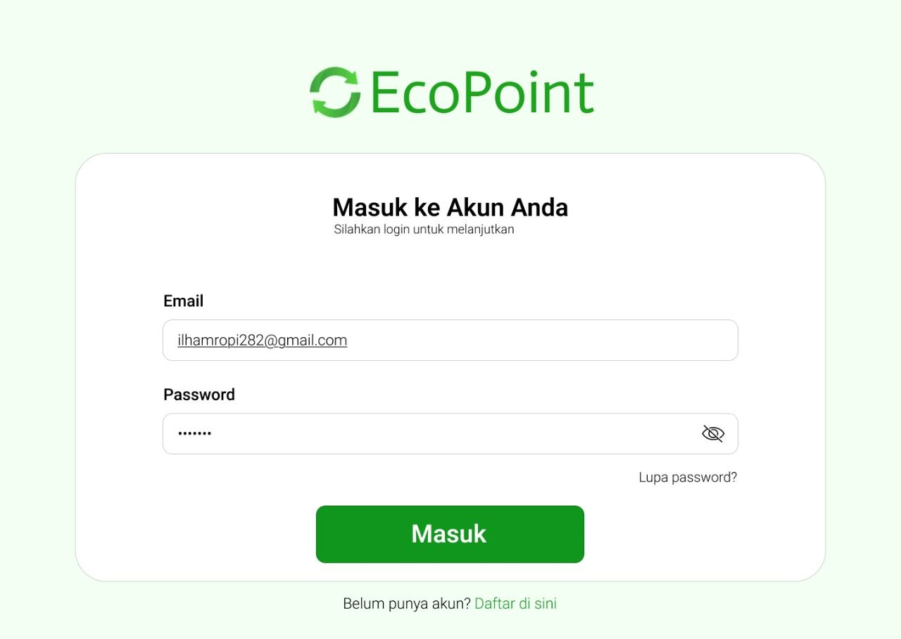
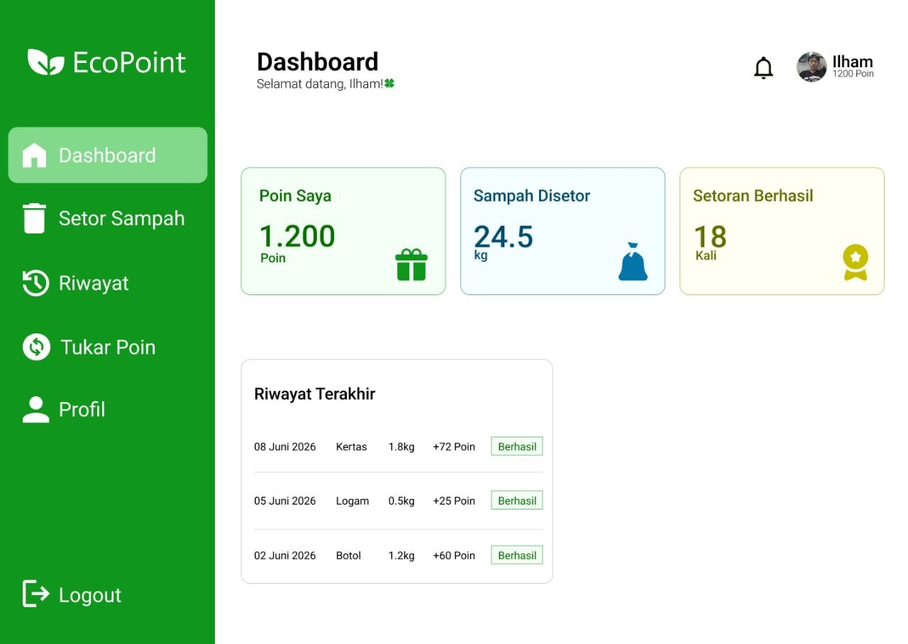
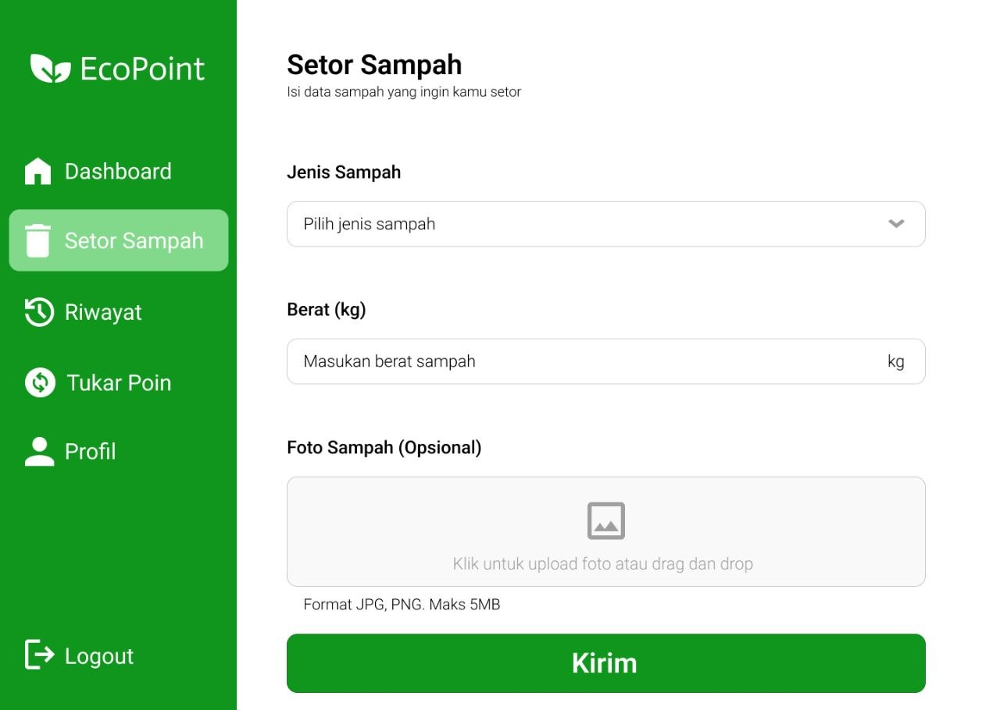
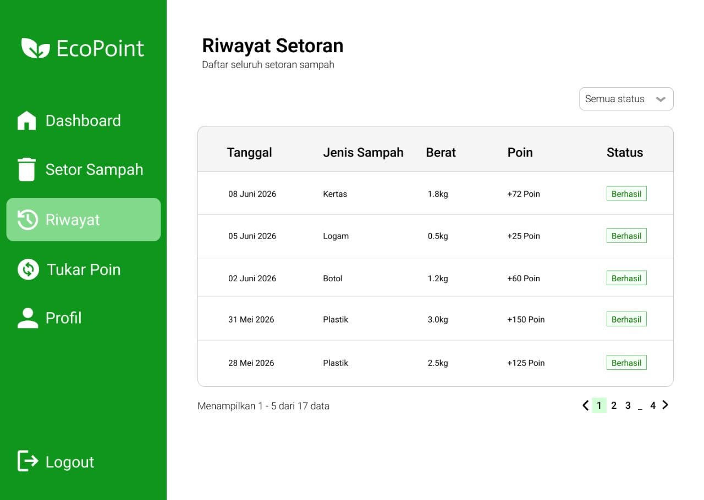
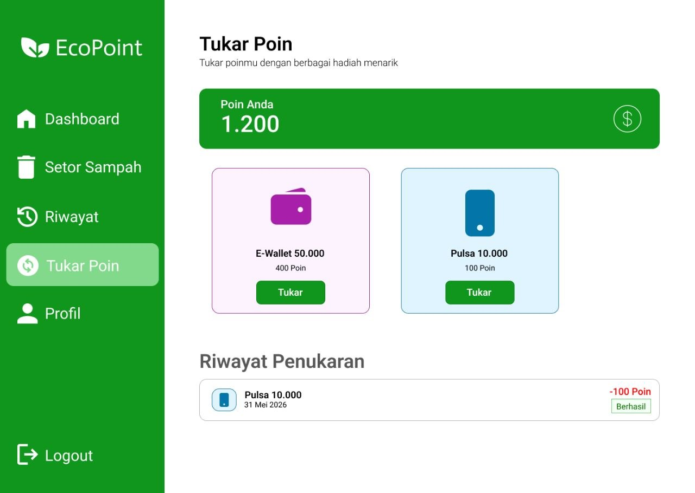
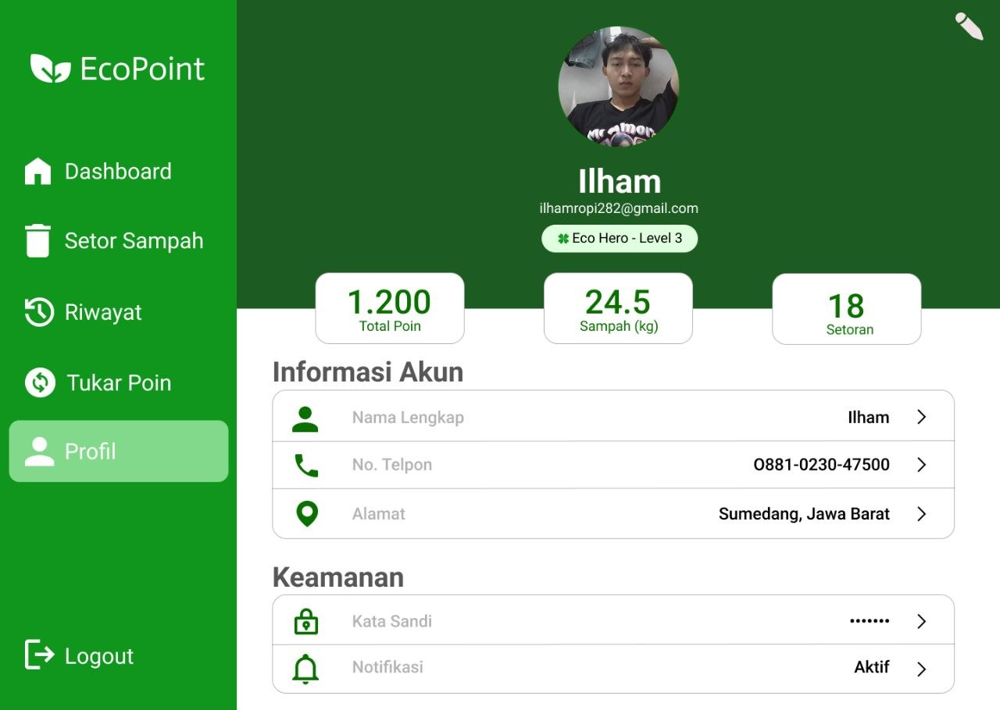

# Software Design Description
## EcoPoint — Sistem Informasi Daur Ulang Sampah Berbasis Poin

Version 1.0  
Prepared by Tim Pengembang EcoPoint  
Teknik Informatika, Universitas Halim Sanusi  
Juni 2026

## Table of Contents
* [1. Introduction](#1-introduction)
  * [1.1 Document Purpose](#11-document-purpose)
  * [1.2 Subject Scope](#12-subject-scope)
  * [1.3 Definitions, Acronyms, and Abbreviations](#13-definitions-acronyms-and-abbreviations)
  * [1.4 References](#14-references)
  * [1.5 Document Overview](#15-document-overview)
* [2. Design Overview](#2-design-overview)
  * [2.1 Stakeholder Concerns](#21-stakeholder-concerns)
  * [2.2 Selected Viewpoints](#22-selected-viewpoints)
* [3. Design Views](#3-design-views)
* [4. Decisions](#4-decisions)
* [5. Appendixes](#5-appendixes)

---

## 1. Introduction

### 1.1 Document Purpose
Dokumen *Software Design Description* (SDD) ini menjabarkan arsitektur dan rancangan teknis sistem **EcoPoint — Sistem Informasi Daur Ulang Sampah Berbasis Poin**. Dokumen ini disusun sebagai acuan implementasi bagi tim pengembang dan sebagai referensi pemeliharaan bagi operator sistem di tahap siklus hidup perangkat lunak.

### 1.2 Subject Scope
Sistem yang dirancang adalah **EcoPoint**, platform web responsif untuk manajemen bank sampah digital berbasis poin insentif. Tujuan utamanya adalah mendigitalisasi seluruh alur kerja bank sampah, mulai dari registrasi pengguna, pengajuan setoran, penimbangan manual oleh Admin Gudang, pemberian poin oleh Super Admin, pencairan poin, hingga pengelolaan inventori dan penjualan ke mitra.

**Alur inti sistem EcoPoint:**
* Pengguna mendaftar dan memiliki akun.
* Pengguna mengisi formulir setoran dengan jenis sampah dan estimasi berat.
* Pengguna mengantarkan sampah ke gudang.
* Admin Gudang menimbang sampah secara manual dan menginput berat aktual ke sistem.
* Super Admin meninjau data timbangan dan menambahkan poin.
* Pengguna dapat melihat saldo poin dan mengajukan redeem.
* Sampah yang terkumpul masuk inventori dan dapat dijual ke mitra.

### 1.3 Definitions, Acronyms, and Abbreviations
| Term | Definition |
|------|------------|
| ACID | Atomicity, Consistency, Isolation, Durability — properti transaksi basis data. |
| API | Application Programming Interface — antarmuka komunikasi antar komponen perangkat lunak. |
| EcoPoint | Sistem informasi daur ulang sampah berbasis poin digital yang didokumentasikan dalam SDD ini. |
| Formulir Setoran | Form online yang diisi pengguna sebelum mengantarkan sampah. |
| Mitra | Pihak eksternal yang membeli sampah terkumpul dari gudang bank sampah. |
| Payment Gateway | Layanan pihak ketiga (GoPay/OVO/DANA) yang memproses transfer dana saat poin diredeem. |
| Poin | Insentif digital yang diperoleh pengguna dari setoran sampah. |
| RBAC | Role-Based Access Control — kontrol akses berbasis peran pengguna. |
| Redeem | Pencairan poin ke e-wallet atau uang tunai. |
| SDD | Software Design Description — dokumen ini. |
| SRS | Software Requirement Specification. |
| Timbangan Manual | Timbangan konvensional (tidak terhubung jaringan) yang dibaca Admin Gudang lalu diinput ke sistem. |
| UML | Unified Modeling Language — notasi standar untuk pemodelan sistem perangkat lunak. |

### 1.4 References
| No | Judul Dokumen | Penulis / Pemilik | Tipe |
|----|---------------|-------------------|------|
| 1 | Software Requirement Specification (SRS) EcoPoint v1.0 | Tim Pengembang EcoPoint, 2026 | Normatif |
| 2 | Studi Kelayakan & System Request EcoPoint | Tim Pengembang EcoPoint, 2026 | Normatif |
| 3 | UU No. 18 Tahun 2008 tentang Pengelolaan Sampah | Pemerintah Republik Indonesia, 2008 | Normatif |
| 4 | UU No. 27 Tahun 2022 tentang Perlindungan Data Pribadi | Pemerintah Republik Indonesia, 2022 | Normatif |

### 1.5 Document Overview
Dokumen ini dibagi menjadi lima bagian utama:
* **Bagian 1 (Introduction)** mencakup tujuan dokumen, ruang lingkup subjek, definisi, dan referensi.
* **Bagian 2 (Design Overview)** mendeskripsikan kekhawatiran pemangku kepentingan dan sudut pandang (viewpoint) yang dipilih.
* **Bagian 3 (Design Views)** mendokumentasikan elemen desain arsitektur menggunakan diagram UML.
* **Bagian 4 (Decisions)** mendokumentasikan catatan keputusan arsitektur (ADR) dan justifikasinya.
* **Bagian 5 (Appendixes)** menyediakan material pendukung seperti kelayakan TELOS dan timeline.

---

## 2. Design Overview

### 2.1 Stakeholder Concerns
| Pemangku Kepentingan | Kekhawatiran Utama | Viewpoint yang Menjawab |
|---|---|---|
| **User** | Kemudahan setoran, transparansi saldo poin, kemudahan redeem | Context, Interface, Interaction, State Dynamics |
| **Admin Gudang** | Efisiensi input timbangan manual, kejelasan antrian, kelola inventori | Composition, Interaction, State Dynamics |
| **Super Admin** | Kontrol penambahan poin, approval redeem, keakuratan kalkulasi | Information, Algorithm, Interface, Interaction |
| **Tim Pengembang** | Modularitas kode, kejelasan model data, maintainability, deployment mudah | Logical, Information, Composition, Deployment |

### 2.2 Selected Viewpoints
* **Context** — Batas sistem, aktor eksternal, dan use case. Bahasa: UML Use Case Diagram.
* **Composition** — Dekomposisi lapisan dan modul fungsional. Bahasa: Layer Diagram.
* **Logical** — Struktur kelas/entitas domain dan relasi. Bahasa: UML Class Diagram.
* **Information** — Skema data persisten dan integritas referensial. Bahasa: Deskripsi skema relasional.
* **Interface** — Kontrak REST API dan desain layar. Bahasa: Tabel endpoint, UI wireframe.
* **Interaction** — Alur kolaborasi runtime pada skenario inti. Bahasa: UML Sequence Diagram.
* **Algorithm** — Logika kalkulasi poin. Bahasa: Pseudocode.
* **State Dynamics** — State dan transisi entitas Deposit & Redemption. Bahasa: UML State Machine Diagram.
* **Deployment** — Pemetaan komponen ke node eksekusi. Bahasa: UML Deployment Diagram.

---

## 3. Design Views

* **ID:** 001-ContextView
* **Title:** EcoPoint Context Architecture
* **Viewpoint:** Context
* **Representation:** UML Use Case Diagram. Sistem berinteraksi dengan lima aktor eksternal: **User** (mendaftar, setoran, lihat saldo, redeem), **Admin Gudang** (input timbangan, kelola inventori), **Super Admin** (tambah poin, approval redeem, konfigurasi harga), **Payment Gateway** (proses transfer payout), dan **Mitra** (pembeli sampah terkumpul). Mencakup 15 Use Case utama. Relasi include: UC-09 Tambah Poin «include» UC-08 Review Data Timbangan; UC-11 Setujui Redeem «include» UC-15 Proses Transfer E-Wallet.


*Gambar 3.1 – Use Case Diagram Sistem EcoPoint*

* **More Information:** Use case mengacu pada SRS EcoPoint v1.0 Bagian 3. Lihat juga `→ DEC-001`.

---

* **ID:** 002-CompositionView
* **Title:** EcoPoint Component Decomposition
* **Viewpoint:** Composition
* **Representation:** Sistem didekomposisi menjadi arsitektur tiga lapisan dalam satu codebase monolitik PHP (`→ DEC-001`): **Lapisan Presentasi** (Auth Pages, User Dashboard, Admin Panel, Super Admin Panel), **Lapisan Logika Bisnis** (Auth & RBAC, Deposit Module, Poin & Kalkulasi, Redeem & Payout, Inventori, Penjualan Mitra, Harga Config, Notifikasi), dan **Lapisan Data** (MySQL/MariaDB, `→ DEC-002`). Modul manajemen terisolasi secara peran melalui RBAC.
* **More Information:** Keputusan monolitik di `→ DEC-001`; lapisan data di `→ DEC-002`.

---

* **ID:** 003-LogicalView
* **Title:** Core Domain Model
* **Viewpoint:** Logical
* **Representation:** UML Class Diagram. Entitas utama: `User`, `Deposit`, `PointTransaction`, `Redemption`, `InventoryItem`, `PartnerSale`, `PriceSetting`. Relasi kardinalitas utama: `User 1 → N Deposit`, `User 1 → N Redemption`, `User 1 → N PointTransaction`, `Deposit 1 → 0..1 PointTransaction`, `InventoryItem 1 → N PartnerSale`.


*Gambar 3.2 – Class Diagram Domain EcoPoint*

**Ringkasan Relasi:**

| Relasi | Kardinalitas |
|--------|-------------|
| User → Deposit | 1 : N |
| User → Redemption | 1 : N |
| User → PointTransaction | 1 : N |
| Deposit → PointTransaction | 1 : 0..1 |
| PriceSetting → Deposit | 1 : N |
| InventoryItem → PartnerSale | 1 : N |

* **More Information:** Entitas dipetakan langsung ke tabel pada Information View (3.4).

---

* **ID:** 004-InformationView
* **Title:** Persistent Data Schema
* **Viewpoint:** Information
* **Representation:** Skema Database Relasional (MySQL/MariaDB, `→ DEC-002`) dengan tujuh tabel: `users`, `deposits`, `point_transactions`, `redemptions`, `inventory_items`, `partner_sales`, `price_settings`.

| Prinsip | Implementasi |
|---------|-------------|
| Referential Integrity | `FOREIGN KEY` pada seluruh relasi antar tabel |
| Not Null | Semua atribut wajib dikodekan `NOT NULL` |
| Unique Email | `UNIQUE` pada `users.email` |
| Enum Status | Field status menggunakan `ENUM` untuk membatasi nilai valid |
| ACID Transaction | Proses tambah poin dan redeem dieksekusi dalam satu `BEGIN...COMMIT` |
| Soft Delete | Pengguna nonaktif mengubah `status = 'nonaktif'`, tidak dihapus fisik |

* **More Information:** Keputusan MySQL/MariaDB di `→ DEC-002`. Penggunaan transaksi database diwajibkan pada proses tambah poin dan pencairan (redeem).

---

* **ID:** 005-InterfaceView
* **Title:** REST API Specifications & UI Wireframes
* **Viewpoint:** Interface
* **Representation:** Seluruh endpoint menggunakan prefix `/api/v1/` dan mengembalikan JSON. Autentikasi menggunakan Bearer Token (session-based).

| Method | Endpoint | Deskripsi | Peran |
|--------|----------|-----------|-------|
| `POST` | `/auth/register` | Registrasi akun baru | Publik |
| `POST` | `/auth/login` | Login, mendapat session token | Semua |
| `GET`  | `/users/me` | Profil dan saldo poin terkini | User |
| `POST` | `/deposits` | Membuat pengajuan setoran | User |
| `GET`  | `/deposits` | Daftar setoran (difilter per peran) | Semua |
| `POST` | `/deposits/{id}/weigh` | Input berat aktual | Admin Gudang |
| `POST` | `/deposits/{id}/reject` | Menolak setoran | Admin Gudang |
| `POST` | `/deposits/{id}/add-points` | Menambah poin ke user | Super Admin |
| `POST` | `/redemptions` | Mengajukan redeem | User |
| `PUT`  | `/redemptions/{id}/approve` | Menyetujui redeem + trigger payment | Super Admin |
| `PUT`  | `/redemptions/{id}/reject` | Menolak redeem | Super Admin |
| `GET`  | `/inventory` | Melihat stok inventori | AG / SA |
| `POST` | `/inventory/sell` | Catat penjualan ke mitra | Admin Gudang |
| `PUT`  | `/price-settings/{id}` | Update konfigurasi harga | Super Admin |

#### Desain Layar Antarmuka Pengguna (User Interface)

Berikut adalah tampilan antarmuka sistem EcoPoint untuk peran **User**, mencakup enam layar utama yang telah diimplementasikan.

---

**Layar 1 — Login**

Halaman autentikasi dengan form email dan password. Menampilkan opsi *lupa password* dan tautan pendaftaran akun baru. Desain minimalis dengan latar hijau muda dan form terpusat.



*Gambar UI-1 – Halaman Login*

---

**Layar 2 — Dashboard**

Halaman utama setelah login. Menampilkan tiga kartu ringkasan: **Poin Saya** (saldo poin terkini), **Sampah Disetor** (total kg), dan **Setoran Berhasil** (jumlah transaksi). Di bawahnya terdapat tabel *Riwayat Terakhir* yang memperlihatkan tiga setoran terbaru beserta tanggal, jenis sampah, berat, poin, dan status.



*Gambar UI-2 – Dashboard User*

---

**Layar 3 — Setor Sampah**

Form pengajuan setoran baru. User memilih jenis sampah melalui dropdown, mengisi estimasi berat (kg), dan secara opsional mengunggah foto sampah (format JPG/PNG, maks 5 MB). Tombol **Kirim** mengirim data ke endpoint `POST /api/v1/deposits`.



*Gambar UI-3 – Form Setor Sampah*

---

**Layar 4 — Riwayat Setoran**

Menampilkan seluruh riwayat setoran dalam format tabel berkolom: Tanggal, Jenis Sampah, Berat, Poin, dan Status. Dilengkapi filter dropdown *Semua Status* dan pagination (menampilkan 5 dari 17 data per halaman).



*Gambar UI-4 – Riwayat Setoran*

---

**Layar 5 — Tukar Poin**

Halaman redeem/penukaran poin. Bagian atas menampilkan saldo poin aktif. Di bawahnya tersedia pilihan reward (E-Wallet Rp 50.000 = 400 poin; Pulsa Rp 10.000 = 100 poin) dalam bentuk kartu dengan tombol **Tukar**. Bagian bawah menampilkan riwayat penukaran yang telah dilakukan beserta status.



*Gambar UI-5 – Tukar Poin*

---

**Layar 6 — Profil**

Halaman profil pengguna dengan header hijau yang menampilkan foto, nama, email, dan badge level (*Eco Hero - Level 3*). Tiga kartu statistik menampilkan Total Poin, total Sampah (kg), dan jumlah Setoran. Bagian bawah berisi informasi akun yang dapat diedit (nama, no. telepon, alamat) serta pengaturan keamanan (kata sandi dan notifikasi).



*Gambar UI-6 – Profil Pengguna*

---

* **More Information:** Desain layar berfokus pada kemudahan akses antrian setoran (Admin Gudang) dan verifikasi timbangan manual. Endpoint `/deposits/{id}/add-points` mengimplementasikan algoritma di 007-AlgorithmView.

---

* **ID:** 006-InteractionView
* **Title:** Waste Deposit & Redeem Sequence
* **Viewpoint:** Interaction
* **Representation:** UML Sequence Diagram. **Alur Setoran:** User POST formulir → Deposit tersimpan (`menunggu_verifikasi`) → Admin Gudang input berat aktual → status `menunggu_poin` → Super Admin tinjau dan konfirmasi → Sistem eksekusi transaksi atomik ACID (update saldo, catat PointTransaction, update status deposit, update inventori). **Alur Redeem:** User POST redeem [guard: saldo cukup] → Super Admin approve → Payment Gateway dipanggil → jika sukses, debit poin atomik; jika gagal, status `gagal_transfer` tanpa debit poin.


*Gambar 3.6 – Sequence Diagram Alur Setoran Sampah End-to-End*

* **More Information:** Sinkronisasi pembaruan inventori dilakukan bersamaan dengan transaksi penambahan poin. Keputusan penimbangan manual di `→ DEC-003`.

---

* **ID:** 007-AlgorithmView
* **Title:** Point Calculation Logic
* **Viewpoint:** Algorithm
* **Representation:** Formula utama kalkulasi poin:

```
Nilai Sampah (Rp) = berat_aktual_kg × harga_per_kg
Poin              = ROUND(Nilai Sampah × (persentase_insentif / 100))
```

Contoh: Plastik 5 kg × Rp 2.000 × 50% = **5.000 poin**; Kertas 1,8 kg × Rp 1.500 × 60% = **1.620 poin**.

Langkah eksekusi: (1) Ambil deposit berstatus `menunggu_poin`, (2) cek `price_settings` aktif berdasarkan jenis sampah, (3) hitung poin, (4) tampilkan preview ke Super Admin, (5) jika dikonfirmasi, jalankan transaksi atomik: update `users.poin_saldo`, INSERT `point_transactions`, UPDATE `deposits.status → selesai`, UPDATE `inventory_items`.

| Edge Case | Penanganan |
|-----------|-----------|
| `berat_aktual_kg = 0` | Validasi pre-query, return 422 |
| Harga jenis sampah belum dikonfigurasi | Validasi pre-query, return 422 |
| Deposit sudah berstatus `selesai` | Idempotency guard, return 422 |
| Salah satu query transaksi gagal | ROLLBACK, return 500, tidak ada perubahan parsial |

* **More Information:** Algoritma berjalan pada sisi backend dan dieksekusi secara ketat oleh Super Admin via endpoint `POST /deposits/{id}/add-points`.

---

* **ID:** 008-StateDynamicsView
* **Title:** Deposit & Redemption State Machine
* **Viewpoint:** State Dynamics
* **Representation:** UML State Machine Diagram.

**State Deposit:** `(init) → menunggu_verifikasi → menunggu_poin (atau ditolak) → selesai`.
**State Redemption:** `(init) → menunggu_persetujuan → disetujui (atau ditolak / gagal_transfer)`.

Transisi dibatasi secara ketat (guards) oleh role aktor yang sedang login.


*Gambar 3.8 – State Machine Diagram Deposit dan Redemption*

| State Asal | Event / Guard | State Tujuan | Efek Samping |
|------------|---------------|-------------|-------------|
| *(init)* | User POST /deposits | `menunggu_verifikasi` | — |
| `menunggu_verifikasi` | AG input berat aktual > 0 | `menunggu_poin` | Kirim notif ke SA |
| `menunggu_verifikasi` | AG tolak setoran | `ditolak` | Kirim notif ke User |
| `menunggu_poin` | SA konfirmasi tambah poin | `selesai` | Kredit poin, update inventori, notif User |
| *(init)* | User POST, saldo cukup | `menunggu_persetujuan` | Notif ke SA |
| `menunggu_persetujuan` | SA setujui + PG sukses | `disetujui` | Debit poin, notif sukses |
| `menunggu_persetujuan` | SA setujui + PG gagal | `gagal_transfer` | Poin tidak didebit, notif SA |
| `menunggu_persetujuan` | SA tolak | `ditolak` | Notif User |

* **More Information:** Transisi state dipicu oleh endpoint di Interface View (005). State `selesai` dan `disetujui` memicu pembaruan `PointTransaction`.

---

* **ID:** 009-DeploymentView
* **Title:** Production Infrastructure
* **Viewpoint:** Deployment
* **Representation:** Lingkungan eksekusi menggunakan satu Cloud Server Linux yang memuat Nginx, PHP 8.1+, dan MySQL/MariaDB. Klien menggunakan browser web responsif pada smartphone atau PC. Komunikasi menggunakan HTTPS (TLS). Payment Gateway dipanggil via REST API eksternal saat proses redeem disetujui. Timbangan manual beroperasi sebagai perangkat fisik terpisah (offline) dan tidak memerlukan topologi IoT.

| Node | Komponen | Keterangan |
|------|----------|-----------|
| Cloud Server Linux | Nginx + PHP 8.1+ + MySQL/MariaDB | Satu VPS untuk app dan DB pada tahap awal |
| Browser User | Chrome/Firefox/Safari modern | Smartphone atau PC |
| Browser Admin Gudang | Chrome/Firefox | Smartphone di gudang |
| Browser Super Admin | Chrome/Firefox | PC/laptop |
| Payment Gateway | REST API eksternal | GoPay/OVO/DANA, dipanggil saat approve redeem |
| Timbangan Manual | Perangkat fisik | Tidak terhubung jaringan; dibaca manual oleh Admin Gudang |

* **More Information:** Keputusan deployment monolitik di `→ DEC-001`. Keputusan timbangan manual di `→ DEC-003`.

---

## 4. Decisions

* **ID:** DEC-001
* **Title:** Arsitektur Web Monolitik Berbasis PHP
* **Context:** Tim pengembang terdiri dari 5 orang dengan waktu pengembangan terbatas (4 bulan). Kompleksitas fungsional v1.0 masih dapat dikelola dalam satu codebase. Alternatif microservices memerlukan keahlian DevOps yang belum dimiliki tim.
* **Options:** (1) Monolitik PHP, (2) Microservices Node.js/Go, (3) Serverless, (4) Laravel monolitik (MVC).
* **Outcome:** Dipilih **Monolitik PHP** (dengan Laravel sebagai framework pendukung): seluruh anggota tim familiar dengan PHP, deployment ke VPS Linux sederhana, ekosistem library mencukupi, onboarding minimal. Konsekuensi: skalabilitas horizontal memerlukan refactoring jika pengguna tumbuh signifikan.
* **More Information:** Mempengaruhi 002-CompositionView dan 009-DeploymentView.

---

* **ID:** DEC-002
* **Title:** Basis Data Relasional MySQL/MariaDB
* **Context:** Modul poin, deposit, dan inventori membutuhkan konsistensi data yang ketat untuk mencegah kebocoran saldo. Data memiliki relasi yang jelas dan terstruktur antar entitas. Tim memiliki pengalaman dengan MySQL.
* **Options:** (1) MySQL/MariaDB, (2) PostgreSQL, (3) MongoDB, (4) SQLite.
* **Outcome:** Dipilih **MySQL/MariaDB**: mendukung ACID transaction yang krusial untuk proses kritis, model relasional sesuai struktur data EcoPoint, selaras dengan ekosistem PHP, biaya lisensi nol.
* **More Information:** Mempengaruhi 004-InformationView dan 007-AlgorithmView.

---

* **ID:** DEC-003
* **Title:** Penimbangan Manual oleh Admin Gudang
* **Context:** Proses penimbangan adalah langkah kritis dalam alur setoran. Terdapat pilihan antara timbangan konvensional dengan input manual, atau timbangan digital IoT yang mengirim data otomatis ke sistem.
* **Options:** (1) Timbangan Manual (input via browser), (2) Timbangan IoT (Bluetooth/WiFi), (3) Timbangan IoT + validasi manual.
* **Outcome:** Dipilih **Timbangan Manual**: menghilangkan kompleksitas hardware IoT, menurunkan biaya infrastruktur, mempercepat implementasi. Konsekuensi: ketergantungan pada ketelitian Admin Gudang — dimitigasi dengan validasi range berat di sisi sistem, audit log, dan review oleh Super Admin (UC-08).
* **More Information:** Tercermin di 001-ContextView (tidak ada aktor IoT), 006-InteractionView (langkah 3-4 terjadi di luar sistem), dan 009-DeploymentView.

---

## 5. Appendixes

### Appendix A: Ringkasan Kelayakan TELOS

| Aspek | Nilai | Justifikasi Singkat |
|-------|-------|---------------------|
| **Technical** | 9.0 / 10 | Stack PHP + MySQL sudah matang; risiko teknis rendah |
| **Economic** | 9.0 / 10 | Open-source stack; hosting VPS terjangkau; ROI positif |
| **Legal** | 10.0 / 10 | Sesuai UU No. 18/2008 dan UU No. 27/2022 |
| **Operational** | 8.5 / 10 | Admin dapat dilatih dalam waktu singkat; antarmuka intuitif |
| **Schedule** | 9.5 / 10 | Timeline 4 bulan realistis untuk ruang lingkup v1.0 |

### Appendix B: Struktur Organisasi Tim Pengembang

| Peran | Tanggung Jawab Utama |
|-------|---------------------|
| Product Owner | Mendefinisikan kebutuhan, prioritas fitur, dan acceptance criteria |
| Project Manager | Mengelola jadwal, risiko, komunikasi, dan deliverable tim |
| System Analyst | Menganalisis kebutuhan, merancang solusi teknis, menyusun SRS dan SDD |
| Programmer | Mengimplementasikan kode berdasarkan SDD; unit testing |
| Tester | Menyusun test plan, menjalankan pengujian fungsional dan regresi |

### Appendix C: Spesifikasi Teknis Minimum

| Komponen | Minimum |
|----------|---------|
| OS Server | Ubuntu Server 20.04 LTS |
| Web Server | Nginx 1.18+ atau Apache 2.4+ |
| Runtime | PHP 8.1+ (pdo_mysql, mbstring, openssl) |
| Database | MySQL 8.0+ atau MariaDB 10.6+ |
| RAM | 2 GB |
| Storage | 20 GB SSD |
| Browser | Chrome 90+, Firefox 88+, Safari 14+ |
| Koneksi | Internet 1 Mbps |
| Timbangan | Digital atau analog standar (tidak perlu terhubung jaringan) |

### Appendix D: Timeline Pengembangan

| Bulan | Fase | Deliverable |
|-------|------|-------------|
| **Bulan 1** | Perancangan | Finalisasi SRS & SDD, desain skema DB, wireframe UI |
| **Bulan 2** | Implementasi Inti | Auth/RBAC, modul Deposit, input timbangan, kalkulasi & tambah poin |
| **Bulan 3** | Implementasi Lanjutan | Redeem + Payment Gateway, Inventori, Penjualan Mitra, Notifikasi |
| **Bulan 4** | Testing & Deployment | UAT, perbaikan bug, deployment cloud server, pelatihan admin |
